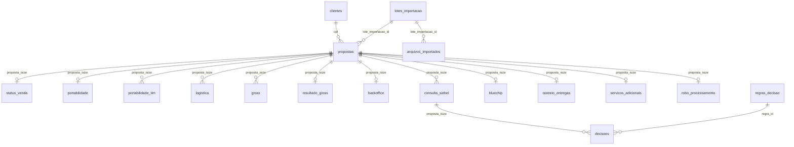
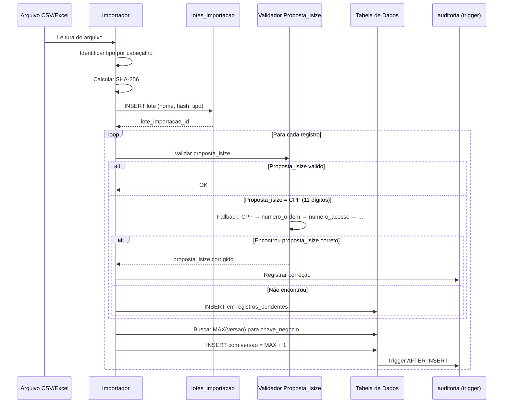

# Documento de Design — Redesign do Banco de Dados de Portabilidade

## Visão Geral

Este documento descreve o design técnico completo para o redesign do banco de dados SQLite do sistema 3F Qigger DB Gerenciador. O novo schema substitui a estrutura atual (28 tabelas com dados desnormalizados e problemas de integridade) por uma arquitetura normalizada, imutável e versionada.

### Princípios Fundamentais

1. **Imutabilidade**: Tabelas de dados são INSERT-only. Nenhum UPDATE é permitido. Cada alteração gera uma nova versão do registro.
2. **Versionamento**: Toda tabela de dados possui `versao INTEGER NOT NULL DEFAULT 1` e constraint UNIQUE em `(chave_negocio, versao)`.
3. **Rastreabilidade**: Todo registro possui `lote_importacao_id` e `created_at`, permitindo rastrear a origem de cada dado.
4. **Normalização**: Os 76+ campos da `base_coverte_prop` são distribuídos em 8 tabelas especializadas. Cada fonte de dados tem sua tabela dedicada.
5. **Views para Registro Corrente**: Views `vw_<tabela>_corrente` filtram `MAX(versao)` para uso operacional.

### Decisões de Design

- **SQLite mantido**: O volume de dados (~800K registros totais) é adequado para SQLite com WAL mode e otimizações de cache.
- **Triggers BEFORE UPDATE**: Bloqueiam UPDATE em tabelas de dados, forçando o padrão INSERT-only.
- **Triggers AFTER INSERT para auditoria**: Capturam automaticamente cada inserção na tabela `auditoria`.
- **Cache materializado**: `cache_base_unificada` substitui a antiga `base_unificada` como tabela materializada, atualizada via aplicação (não via trigger SQLite, por limitação de performance).
- **Chave principal**: `proposta_isize` é a chave de ligação universal entre todas as tabelas de dados.

## Arquitetura

### Diagrama de Associação por Chaves



### Chaves de Associação entre Fontes

| Chave | Arquivo 1 (COVERTE) | Arquivo 2 (TIM) | Arquivo 3 (GROSS) | Arquivo 4 (Objetos) | Arquivo 5 (Res.GROSS) | Arquivo 6 (Backoffice) | Arquivo 7 (Siebel) |
|-------|---------------------|------------------|--------------------|---------------------|----------------------|----------------------|---------------------|
| **Proposta** | `Proposta iSize` | — | — | `Id Auxiliar1` | `Proposta` | `PEDIDO` | `Código externo` |
| **Telefone portado** | `Telefone Portabilidade` | `ACESSO` | `ACESSO` | — | `Numero Acesso` | `NUMERO_PORTADO` | `Número de acesso` |
| **Nº Ordem** | `Numero OS` | — | — | `ID ERP` | — | — | `Número da ordem` |
| **Nº Provisório** | `Numero linha` | `ACESSO_TEMPORARIO` | — | — | — | `NUMERO_PROVISORIO` | `Número temporário` |
| **CPF** | `CPF` | `CPF_CNPJ` | — | `Documento` | `CPF` | `CPF` | `Cpf` |

### Categorias de Tabelas

```
┌─────────────────────────────────────────────────────────────┐
│                    TABELAS DE DADOS                         │
│              (INSERT-only, versionadas)                     │
│                                                             │
│  clientes, propostas, status_venda, portabilidade,          │
│  portabilidade_tim, logistica, gross, resultado_gross,      │
│  backoffice, consulta_siebel, bluechip, rastreio_entregas,  │
│  servicos_adicionais, robo_processamento, decisoes,         │
│  regras_decisao, templates_wpp, tipo_comunicacao_template   │
├─────────────────────────────────────────────────────────────┤
│                   TABELAS DE CONTROLE                       │
│              (UPDATE permitido)                             │
│                                                             │
│  lotes_importacao, arquivos_importados,                     │
│  execucoes_processamento, auditoria, schema_versao,         │
│  historico_backups, metricas_processamento,                  │
│  cache_base_unificada, registros_pendentes                  │
├─────────────────────────────────────────────────────────────┤
│                   TABELAS MANTIDAS                          │
│              (Auxiliares, sem alteração)                     │
│                                                             │
│  consultas_telegram, dados_cadastrais, disparos_wpp,        │
│  enderecos_corrigidos, enriquecimento_remessas, estornos,   │
│  relatorio_faturamento, tim_pre_controle, config_periodo,   │
│  bs_venda_du                                                │
└─────────────────────────────────────────────────────────────┘
```

## Componentes e Interfaces

### Fluxo de Importação



### Interface do DatabaseManager (novo)

O `DatabaseManager` refatorado expõe os seguintes métodos principais:

- `inserir_registro(tabela, dados, lote_id)` → INSERT com versionamento automático
- `buscar_corrente(tabela, chave_negocio, valor)` → Consulta via view `vw_<tabela>_corrente`
- `buscar_historico(tabela, chave_negocio, valor)` → Todas as versões ordenadas por `versao ASC`
- `criar_lote(nome_arquivo, tipo, hash_sha256)` → Registra lote de importação
- `atualizar_cache_unificada(proposta_isize)` → Atualiza `cache_base_unificada` para uma proposta
- `validar_integridade()` → Executa `PRAGMA integrity_check` e retorna resultado


## Modelo de Dados

### Configurações de Performance (PRAGMAs)

```sql
-- Aplicar ANTES de qualquer operação no banco
PRAGMA journal_mode = WAL;
PRAGMA synchronous = NORMAL;
PRAGMA cache_size = -128000;        -- 128MB de cache
PRAGMA temp_store = MEMORY;
PRAGMA mmap_size = 536870912;       -- 512MB mmap
PRAGMA auto_vacuum = INCREMENTAL;
PRAGMA foreign_keys = ON;
```

---

### 1. Tabelas de Controle (UPDATE permitido)

#### 1.1 schema_versao

```sql
CREATE TABLE IF NOT EXISTS schema_versao (
    id INTEGER PRIMARY KEY AUTOINCREMENT,
    versao INTEGER NOT NULL UNIQUE,
    descricao TEXT NOT NULL,
    script_sql TEXT,
    aplicado_em TIMESTAMP DEFAULT CURRENT_TIMESTAMP
);

INSERT INTO schema_versao (versao, descricao) VALUES (1, 'Schema inicial - redesign completo');
```

#### 1.2 lotes_importacao

```sql
CREATE TABLE IF NOT EXISTS lotes_importacao (
    id INTEGER PRIMARY KEY AUTOINCREMENT,
    nome_arquivo TEXT NOT NULL,
    caminho_origem TEXT,
    tipo_arquivo TEXT NOT NULL CHECK (tipo_arquivo IN (
        'coverte_prop', 'portabilidade_tim', 'gross',
        'relatorio_objetos', 'resultado_gross', 'backoffice',
        'consulta_siebel'
    )),
    hash_sha256 TEXT NOT NULL,
    qtd_registros INTEGER DEFAULT 0,
    qtd_inseridos INTEGER DEFAULT 0,
    qtd_erros INTEGER DEFAULT 0,
    status TEXT DEFAULT 'em_andamento' CHECK (status IN (
        'em_andamento', 'concluido', 'erro', 'duplicado'
    )),
    created_at TIMESTAMP DEFAULT CURRENT_TIMESTAMP,
    finalizado_em TIMESTAMP,
    UNIQUE(hash_sha256)
);

CREATE INDEX IF NOT EXISTS idx_lotes_hash ON lotes_importacao(hash_sha256);
CREATE INDEX IF NOT EXISTS idx_lotes_tipo ON lotes_importacao(tipo_arquivo);
CREATE INDEX IF NOT EXISTS idx_lotes_created ON lotes_importacao(created_at DESC);
```

#### 1.3 arquivos_importados

```sql
CREATE TABLE IF NOT EXISTS arquivos_importados (
    id INTEGER PRIMARY KEY AUTOINCREMENT,
    lote_importacao_id INTEGER NOT NULL,
    nome_arquivo TEXT NOT NULL,
    caminho_completo TEXT,
    tamanho_bytes INTEGER,
    created_at TIMESTAMP DEFAULT CURRENT_TIMESTAMP,
    FOREIGN KEY (lote_importacao_id) REFERENCES lotes_importacao(id)
);

CREATE INDEX IF NOT EXISTS idx_arquivos_lote ON arquivos_importados(lote_importacao_id);
```

#### 1.4 execucoes_processamento

```sql
CREATE TABLE IF NOT EXISTS execucoes_processamento (
    id INTEGER PRIMARY KEY AUTOINCREMENT,
    tipo TEXT NOT NULL CHECK (tipo IN (
        'processamento_completo', 'importacao', 'reprocessamento',
        'geracao_homologacao', 'backup', 'migracao'
    )),
    parametros TEXT,
    status TEXT DEFAULT 'em_andamento' CHECK (status IN (
        'em_andamento', 'concluido', 'erro', 'cancelado'
    )),
    etapa_atual TEXT,
    registros_processados INTEGER DEFAULT 0,
    registros_erro INTEGER DEFAULT 0,
    detalhes_erro TEXT,
    inicio_em TIMESTAMP DEFAULT CURRENT_TIMESTAMP,
    fim_em TIMESTAMP,
    duracao_segundos REAL
);

CREATE INDEX IF NOT EXISTS idx_execucoes_status ON execucoes_processamento(status);
CREATE INDEX IF NOT EXISTS idx_execucoes_tipo ON execucoes_processamento(tipo);
CREATE INDEX IF NOT EXISTS idx_execucoes_inicio ON execucoes_processamento(inicio_em DESC);
```

#### 1.5 auditoria

```sql
CREATE TABLE IF NOT EXISTS auditoria (
    id INTEGER PRIMARY KEY AUTOINCREMENT,
    tabela TEXT NOT NULL,
    operacao TEXT NOT NULL CHECK (operacao IN ('INSERT', 'CORRECAO', 'MIGRACAO', 'REGRA_APLICADA')),
    registro_id INTEGER,
    chave_negocio TEXT,
    versao_registro INTEGER,
    valores_json TEXT,
    lote_importacao_id INTEGER,
    execucao_id INTEGER,
    detalhes TEXT,
    tempo_execucao_ms REAL,
    created_at TIMESTAMP DEFAULT CURRENT_TIMESTAMP,
    FOREIGN KEY (lote_importacao_id) REFERENCES lotes_importacao(id),
    FOREIGN KEY (execucao_id) REFERENCES execucoes_processamento(id)
);

CREATE INDEX IF NOT EXISTS idx_auditoria_tabela ON auditoria(tabela);
CREATE INDEX IF NOT EXISTS idx_auditoria_operacao ON auditoria(operacao);
CREATE INDEX IF NOT EXISTS idx_auditoria_chave ON auditoria(chave_negocio);
CREATE INDEX IF NOT EXISTS idx_auditoria_created ON auditoria(created_at DESC);
CREATE INDEX IF NOT EXISTS idx_auditoria_lote ON auditoria(lote_importacao_id);
CREATE INDEX IF NOT EXISTS idx_auditoria_periodo ON auditoria(created_at, tabela);
```

#### 1.6 historico_backups

```sql
CREATE TABLE IF NOT EXISTS historico_backups (
    id INTEGER PRIMARY KEY AUTOINCREMENT,
    nome_arquivo TEXT NOT NULL,
    caminho_destino TEXT NOT NULL,
    destino_tipo TEXT NOT NULL CHECK (destino_tipo IN ('local', 'rede', 'smb')),
    tamanho_bytes INTEGER,
    status TEXT NOT NULL CHECK (status IN ('sucesso', 'falha', 'parcial')),
    detalhes_erro TEXT,
    created_at TIMESTAMP DEFAULT CURRENT_TIMESTAMP
);

CREATE INDEX IF NOT EXISTS idx_backups_created ON historico_backups(created_at DESC);
CREATE INDEX IF NOT EXISTS idx_backups_status ON historico_backups(status);
```

#### 1.7 metricas_processamento

```sql
CREATE TABLE IF NOT EXISTS metricas_processamento (
    id INTEGER PRIMARY KEY AUTOINCREMENT,
    execucao_id INTEGER,
    etapa TEXT NOT NULL,
    registros_total INTEGER DEFAULT 0,
    registros_por_segundo REAL,
    tempo_execucao_ms REAL,
    memoria_utilizada_mb REAL,
    created_at TIMESTAMP DEFAULT CURRENT_TIMESTAMP,
    FOREIGN KEY (execucao_id) REFERENCES execucoes_processamento(id)
);

CREATE INDEX IF NOT EXISTS idx_metricas_execucao ON metricas_processamento(execucao_id);
CREATE INDEX IF NOT EXISTS idx_metricas_etapa ON metricas_processamento(etapa);
```

#### 1.8 registros_pendentes

```sql
CREATE TABLE IF NOT EXISTS registros_pendentes (
    id INTEGER PRIMARY KEY AUTOINCREMENT,
    tabela_origem TEXT NOT NULL,
    dados_json TEXT NOT NULL,
    chave_original TEXT,
    tipo_pendencia TEXT NOT NULL CHECK (tipo_pendencia IN (
        'proposta_isize_pendente', 'chave_duplicada', 'dados_invalidos'
    )),
    tentativas_resolucao INTEGER DEFAULT 0,
    resolvido INTEGER DEFAULT 0,
    proposta_isize_resolvido TEXT,
    lote_importacao_id INTEGER,
    created_at TIMESTAMP DEFAULT CURRENT_TIMESTAMP,
    resolvido_em TIMESTAMP,
    FOREIGN KEY (lote_importacao_id) REFERENCES lotes_importacao(id)
);

CREATE INDEX IF NOT EXISTS idx_pendentes_tipo ON registros_pendentes(tipo_pendencia);
CREATE INDEX IF NOT EXISTS idx_pendentes_resolvido ON registros_pendentes(resolvido);
CREATE INDEX IF NOT EXISTS idx_pendentes_chave ON registros_pendentes(chave_original);
```

#### 1.9 cache_base_unificada

```sql
CREATE TABLE IF NOT EXISTS cache_base_unificada (
    id INTEGER PRIMARY KEY AUTOINCREMENT,
    proposta_isize TEXT NOT NULL UNIQUE,
    cpf TEXT,
    nome_cliente TEXT,
    telefone_portabilidade TEXT,
    numero_linha TEXT,
    numero_ordem TEXT,
    -- Dados de proposta
    data_venda TEXT,
    produto TEXT,
    plano TEXT,
    status_venda TEXT,
    -- Dados de portabilidade
    portabilidade_status TEXT,
    -- Dados TIM
    status_tim TEXT,
    data_ativacao_tim TEXT,
    -- Dados logística
    status_logistica TEXT,
    rastreio TEXT,
    data_entrega TEXT,
    -- Dados GROSS
    data_gross TEXT,
    classificacao_cr TEXT,
    -- Dados resultado GROSS
    resultado_gross TEXT,
    -- Dados backoffice
    status_pedido TEXT,
    detalhe_status TEXT,
    -- Dados Siebel
    status_bilhete TEXT,
    status_ordem TEXT,
    -- Dados Bluechip
    bluechip_status TEXT,
    pedido_bluechip TEXT,
    -- Decisão
    regra_id INTEGER,
    acao_a_realizar TEXT,
    tipo_mensagem TEXT,
    -- Controle
    hash_dados TEXT,
    atualizado_em TIMESTAMP DEFAULT CURRENT_TIMESTAMP
);

CREATE INDEX IF NOT EXISTS idx_cache_proposta ON cache_base_unificada(proposta_isize);
CREATE INDEX IF NOT EXISTS idx_cache_cpf ON cache_base_unificada(cpf);
CREATE INDEX IF NOT EXISTS idx_cache_telefone ON cache_base_unificada(telefone_portabilidade);
CREATE INDEX IF NOT EXISTS idx_cache_atualizado ON cache_base_unificada(atualizado_em DESC);
```

---

### 2. Tabelas de Dados (INSERT-only, versionadas)

#### 2.1 clientes

```sql
CREATE TABLE IF NOT EXISTS clientes (
    id INTEGER PRIMARY KEY AUTOINCREMENT,
    cpf TEXT NOT NULL,
    nome_cliente TEXT,
    data_nascimento TEXT,
    nome_mae TEXT,
    endereco TEXT,
    numero TEXT,
    complemento TEXT,
    bairro TEXT,
    cidade TEXT,
    uf TEXT,
    cep TEXT,
    ponto_referencia TEXT,
    ddd_1 TEXT,
    telefone_1 TEXT,
    ddd_2 TEXT,
    telefone_2 TEXT,
    email TEXT,
    score TEXT,
    versao INTEGER NOT NULL DEFAULT 1,
    lote_importacao_id INTEGER,
    created_at TIMESTAMP DEFAULT CURRENT_TIMESTAMP,
    UNIQUE(cpf, versao),
    FOREIGN KEY (lote_importacao_id) REFERENCES lotes_importacao(id)
);

CREATE INDEX IF NOT EXISTS idx_clientes_cpf ON clientes(cpf);
CREATE INDEX IF NOT EXISTS idx_clientes_cpf_versao ON clientes(cpf, versao DESC);
CREATE INDEX IF NOT EXISTS idx_clientes_created ON clientes(created_at DESC);
CREATE INDEX IF NOT EXISTS idx_clientes_lote ON clientes(lote_importacao_id);
```

#### 2.2 propostas

```sql
CREATE TABLE IF NOT EXISTS propostas (
    id INTEGER PRIMARY KEY AUTOINCREMENT,
    proposta_isize TEXT NOT NULL,
    cpf TEXT NOT NULL,
    data_venda TEXT,
    produto TEXT,
    plano TEXT,
    forma_pagamento TEXT,
    vencimento TEXT,
    tipo_chip TEXT,
    conta_online TEXT,
    vivo_pay TEXT,
    app_adicional TEXT,
    plataforma TEXT,
    nome_equipe TEXT,
    nome_vendedor TEXT,
    login_externo TEXT,
    nome_supervisor TEXT,
    matricula_discador TEXT,
    avulsa TEXT,
    sms_previo TEXT,
    observacoes TEXT,
    versao INTEGER NOT NULL DEFAULT 1,
    lote_importacao_id INTEGER,
    created_at TIMESTAMP DEFAULT CURRENT_TIMESTAMP,
    UNIQUE(proposta_isize, versao),
    FOREIGN KEY (cpf) REFERENCES clientes(cpf),
    FOREIGN KEY (lote_importacao_id) REFERENCES lotes_importacao(id)
);

CREATE UNIQUE INDEX IF NOT EXISTS idx_propostas_isize ON propostas(proposta_isize) WHERE versao = (SELECT MAX(versao) FROM propostas p2 WHERE p2.proposta_isize = propostas.proposta_isize);
CREATE INDEX IF NOT EXISTS idx_propostas_isize_versao ON propostas(proposta_isize, versao DESC);
CREATE INDEX IF NOT EXISTS idx_propostas_cpf ON propostas(cpf);
CREATE INDEX IF NOT EXISTS idx_propostas_created ON propostas(created_at DESC);
CREATE INDEX IF NOT EXISTS idx_propostas_lote ON propostas(lote_importacao_id);
```

#### 2.3 status_venda

```sql
CREATE TABLE IF NOT EXISTS status_venda (
    id INTEGER PRIMARY KEY AUTOINCREMENT,
    proposta_isize TEXT NOT NULL,
    status_venda TEXT,
    motivo_rejeicao_cancelamento TEXT,
    flag TEXT,
    auditoria TEXT,
    qualidade TEXT,
    conectada TEXT,
    data_conectada TEXT,
    versao INTEGER NOT NULL DEFAULT 1,
    lote_importacao_id INTEGER,
    created_at TIMESTAMP DEFAULT CURRENT_TIMESTAMP,
    UNIQUE(proposta_isize, versao),
    FOREIGN KEY (proposta_isize) REFERENCES propostas(proposta_isize),
    FOREIGN KEY (lote_importacao_id) REFERENCES lotes_importacao(id)
);

CREATE INDEX IF NOT EXISTS idx_status_venda_proposta ON status_venda(proposta_isize);
CREATE INDEX IF NOT EXISTS idx_status_venda_proposta_versao ON status_venda(proposta_isize, versao DESC);
CREATE INDEX IF NOT EXISTS idx_status_venda_status ON status_venda(status_venda);
CREATE INDEX IF NOT EXISTS idx_status_venda_lote ON status_venda(lote_importacao_id);
```

#### 2.4 portabilidade

```sql
CREATE TABLE IF NOT EXISTS portabilidade (
    id INTEGER PRIMARY KEY AUTOINCREMENT,
    proposta_isize TEXT NOT NULL,
    telefone_portabilidade TEXT,
    numero_linha TEXT,
    portabilidade_status TEXT,
    complemento_portabilidade TEXT,
    portabilidade_antecipada TEXT,
    data_marcacao_port_antecipada TEXT,
    quem_marcou_port_antecipada TEXT,
    versao INTEGER NOT NULL DEFAULT 1,
    lote_importacao_id INTEGER,
    created_at TIMESTAMP DEFAULT CURRENT_TIMESTAMP,
    UNIQUE(proposta_isize, versao),
    FOREIGN KEY (proposta_isize) REFERENCES propostas(proposta_isize),
    FOREIGN KEY (lote_importacao_id) REFERENCES lotes_importacao(id)
);

CREATE INDEX IF NOT EXISTS idx_portabilidade_proposta ON portabilidade(proposta_isize);
CREATE INDEX IF NOT EXISTS idx_portabilidade_proposta_versao ON portabilidade(proposta_isize, versao DESC);
CREATE INDEX IF NOT EXISTS idx_portabilidade_telefone ON portabilidade(telefone_portabilidade);
CREATE INDEX IF NOT EXISTS idx_portabilidade_lote ON portabilidade(lote_importacao_id);
```

#### 2.5 portabilidade_tim

```sql
CREATE TABLE IF NOT EXISTS portabilidade_tim (
    id INTEGER PRIMARY KEY AUTOINCREMENT,
    proposta_isize TEXT NOT NULL,
    acesso TEXT,
    acesso_temporario TEXT,
    ddd TEXT,
    data_solicitacao TEXT,
    mes_solicitacao TEXT,
    data_ativacao TEXT,
    mes_ativacao TEXT,
    data_conclusao TEXT,
    sky_contrato TEXT,
    sky_cliente TEXT,
    protocolo TEXT,
    operadora_n1 TEXT,
    tipo_pre_pos_controle TEXT,
    tecnologia TEXT,
    voz_dados TEXT,
    doadora TEXT,
    receptora TEXT,
    tipo TEXT,
    status TEXT,
    tipo_segmento_1 TEXT,
    tipo_segmento_2 TEXT,
    tipo_familia_plano TEXT,
    nivel_plano TEXT,
    canal_n0 TEXT,
    canal_n1 TEXT,
    canal_n2 TEXT,
    canal_n3 TEXT,
    canal_n4 TEXT,
    grupo_economico TEXT,
    custcode TEXT,
    cpf_cnpj TEXT,
    portabilidade TEXT,
    motivo_conflito TEXT,
    motivo_cancelamento TEXT,
    self_portin TEXT,
    canal_portabilidade TEXT,
    tentativas TEXT,
    cart_canal_n1 TEXT,
    cart_canal_n2 TEXT,
    versao INTEGER NOT NULL DEFAULT 1,
    lote_importacao_id INTEGER,
    created_at TIMESTAMP DEFAULT CURRENT_TIMESTAMP,
    UNIQUE(proposta_isize, acesso, versao),
    FOREIGN KEY (proposta_isize) REFERENCES propostas(proposta_isize),
    FOREIGN KEY (lote_importacao_id) REFERENCES lotes_importacao(id)
);

CREATE INDEX IF NOT EXISTS idx_port_tim_proposta ON portabilidade_tim(proposta_isize);
CREATE INDEX IF NOT EXISTS idx_port_tim_proposta_versao ON portabilidade_tim(proposta_isize, acesso, versao DESC);
CREATE INDEX IF NOT EXISTS idx_port_tim_acesso ON portabilidade_tim(acesso);
CREATE INDEX IF NOT EXISTS idx_port_tim_acesso_temp ON portabilidade_tim(acesso_temporario);
CREATE INDEX IF NOT EXISTS idx_port_tim_cpf ON portabilidade_tim(cpf_cnpj);
CREATE INDEX IF NOT EXISTS idx_port_tim_lote ON portabilidade_tim(lote_importacao_id);
```

#### 2.6 logistica

```sql
CREATE TABLE IF NOT EXISTS logistica (
    id INTEGER PRIMARY KEY AUTOINCREMENT,
    proposta_isize TEXT NOT NULL,
    nu_pedido TEXT,
    rastreio TEXT,
    iccid TEXT,
    numero_pedido_marketplace TEXT,
    nota_fiscal TEXT,
    serie_nf TEXT,
    data_emissao_nf TEXT,
    chave_nota_fiscal TEXT,
    valor_nf TEXT,
    valor_frete TEXT,
    id_canal_venda TEXT,
    id_warehouse TEXT,
    id_erp TEXT,
    id_transportadora TEXT,
    transportadora TEXT,
    id_servico TEXT,
    nome_servico TEXT,
    destinatario TEXT,
    documento TEXT,
    email TEXT,
    telefone TEXT,
    cidade TEXT,
    uf TEXT,
    cep TEXT,
    data_insercao TEXT,
    data_primeiro_patch TEXT,
    data_ultimo_patch TEXT,
    data_postagem TEXT,
    previsao_entrega TEXT,
    data_prometida TEXT,
    prazo_dias_corridos TEXT,
    prazo_dias_uteis TEXT,
    prazo_efetivo TEXT,
    status TEXT,
    tentativas_entrega TEXT,
    data_entrega TEXT,
    ultima_ocorrencia TEXT,
    data_ultima_ocorrencia TEXT,
    local_ultima_ocorrencia TEXT,
    cidade_ultima_ocorrencia TEXT,
    estado_ultima_ocorrencia TEXT,
    ultima_ocorrencia_cronologica TEXT,
    motivo_devolucao TEXT,
    retorno_fluxo TEXT,
    protocolo_logistica TEXT,
    motivo_abertura_protocolo TEXT,
    status_protocolo TEXT,
    reversa TEXT,
    codigo_coleta_postagem TEXT,
    cd TEXT,
    dispatch TEXT,
    versao INTEGER NOT NULL DEFAULT 1,
    lote_importacao_id INTEGER,
    created_at TIMESTAMP DEFAULT CURRENT_TIMESTAMP,
    UNIQUE(proposta_isize, nu_pedido, versao),
    FOREIGN KEY (proposta_isize) REFERENCES propostas(proposta_isize),
    FOREIGN KEY (lote_importacao_id) REFERENCES lotes_importacao(id)
);

CREATE INDEX IF NOT EXISTS idx_logistica_proposta ON logistica(proposta_isize);
CREATE INDEX IF NOT EXISTS idx_logistica_proposta_versao ON logistica(proposta_isize, nu_pedido, versao DESC);
CREATE INDEX IF NOT EXISTS idx_logistica_nu_pedido ON logistica(nu_pedido);
CREATE INDEX IF NOT EXISTS idx_logistica_id_erp ON logistica(id_erp);
CREATE INDEX IF NOT EXISTS idx_logistica_rastreio ON logistica(rastreio);
CREATE INDEX IF NOT EXISTS idx_logistica_documento ON logistica(documento);
CREATE INDEX IF NOT EXISTS idx_logistica_status ON logistica(status);
CREATE INDEX IF NOT EXISTS idx_logistica_lote ON logistica(lote_importacao_id);
```

#### 2.7 gross

```sql
CREATE TABLE IF NOT EXISTS gross (
    id INTEGER PRIMARY KEY AUTOINCREMENT,
    proposta_isize TEXT NOT NULL,
    acesso TEXT,
    ddd TEXT,
    custcode TEXT,
    operadora_n1 TEXT,
    classificacao_cr TEXT,
    data_gross TEXT,
    nome_pdv TEXT,
    mes TEXT,
    versao INTEGER NOT NULL DEFAULT 1,
    lote_importacao_id INTEGER,
    created_at TIMESTAMP DEFAULT CURRENT_TIMESTAMP,
    UNIQUE(proposta_isize, acesso, versao),
    FOREIGN KEY (proposta_isize) REFERENCES propostas(proposta_isize),
    FOREIGN KEY (lote_importacao_id) REFERENCES lotes_importacao(id)
);

CREATE INDEX IF NOT EXISTS idx_gross_proposta ON gross(proposta_isize);
CREATE INDEX IF NOT EXISTS idx_gross_proposta_versao ON gross(proposta_isize, acesso, versao DESC);
CREATE INDEX IF NOT EXISTS idx_gross_acesso ON gross(acesso);
CREATE INDEX IF NOT EXISTS idx_gross_lote ON gross(lote_importacao_id);
```

#### 2.8 resultado_gross

```sql
CREATE TABLE IF NOT EXISTS resultado_gross (
    id INTEGER PRIMARY KEY AUTOINCREMENT,
    proposta_isize TEXT NOT NULL,
    numero_acesso TEXT,
    data_gross TEXT,
    cpf TEXT,
    iccid TEXT,
    data_arquivo TEXT,
    arquivo_origem TEXT,
    resultado TEXT,
    versao INTEGER NOT NULL DEFAULT 1,
    lote_importacao_id INTEGER,
    created_at TIMESTAMP DEFAULT CURRENT_TIMESTAMP,
    UNIQUE(proposta_isize, versao),
    FOREIGN KEY (proposta_isize) REFERENCES propostas(proposta_isize),
    FOREIGN KEY (lote_importacao_id) REFERENCES lotes_importacao(id)
);

CREATE INDEX IF NOT EXISTS idx_res_gross_proposta ON resultado_gross(proposta_isize);
CREATE INDEX IF NOT EXISTS idx_res_gross_proposta_versao ON resultado_gross(proposta_isize, versao DESC);
CREATE INDEX IF NOT EXISTS idx_res_gross_acesso ON resultado_gross(numero_acesso);
CREATE INDEX IF NOT EXISTS idx_res_gross_lote ON resultado_gross(lote_importacao_id);
```

#### 2.9 backoffice

```sql
CREATE TABLE IF NOT EXISTS backoffice (
    id INTEGER PRIMARY KEY AUTOINCREMENT,
    proposta_isize TEXT NOT NULL,
    pedido TEXT,
    blue_chip TEXT,
    data_venda TEXT,
    tipo_plano TEXT,
    plano_ativado TEXT,
    plano_fidelizado TEXT,
    portabilidade TEXT,
    numero_provisorio TEXT,
    numero_portado TEXT,
    cpf TEXT,
    nome_cliente TEXT,
    endereco TEXT,
    cep TEXT,
    uf TEXT,
    login_vendedor TEXT,
    vendedor TEXT,
    login_bko TEXT,
    bko TEXT,
    data_input_siebel TEXT,
    iccid TEXT,
    data_envio_chip TEXT,
    data_entrega_chip TEXT,
    data_abertura_bp TEXT,
    data_conclusao_bp TEXT,
    status_pedido TEXT,
    detalhe_status TEXT,
    data_atualizacao_status TEXT,
    tempo_tratamento_total TEXT,
    obs_bo TEXT,
    protocolo_conectada TEXT,
    nome_equipe TEXT,
    versao INTEGER NOT NULL DEFAULT 1,
    lote_importacao_id INTEGER,
    created_at TIMESTAMP DEFAULT CURRENT_TIMESTAMP,
    UNIQUE(proposta_isize, versao),
    FOREIGN KEY (proposta_isize) REFERENCES propostas(proposta_isize),
    FOREIGN KEY (lote_importacao_id) REFERENCES lotes_importacao(id)
);

CREATE INDEX IF NOT EXISTS idx_backoffice_proposta ON backoffice(proposta_isize);
CREATE INDEX IF NOT EXISTS idx_backoffice_proposta_versao ON backoffice(proposta_isize, versao DESC);
CREATE INDEX IF NOT EXISTS idx_backoffice_numero_portado ON backoffice(numero_portado);
CREATE INDEX IF NOT EXISTS idx_backoffice_cpf ON backoffice(cpf);
CREATE INDEX IF NOT EXISTS idx_backoffice_status ON backoffice(status_pedido);
CREATE INDEX IF NOT EXISTS idx_backoffice_lote ON backoffice(lote_importacao_id);
```

#### 2.10 consulta_siebel

```sql
CREATE TABLE IF NOT EXISTS consulta_siebel (
    id INTEGER PRIMARY KEY AUTOINCREMENT,
    proposta_isize TEXT NOT NULL,
    cpf TEXT,
    numero_acesso TEXT,
    numero_ordem TEXT,
    codigo_externo TEXT,
    numero_temporario TEXT,
    bilhete_temporario TEXT,
    numero_bilhete TEXT,
    status_bilhete TEXT,
    operadora_doadora TEXT,
    data_portabilidade TEXT,
    motivo_recusa TEXT,
    motivo_cancelamento TEXT,
    ultimo_bilhete TEXT,
    status_ordem TEXT,
    preco_ordem TEXT,
    data_conclusao_ordem TEXT,
    motivo_nao_consultado TEXT,
    motivo_nao_cancelado TEXT,
    motivo_nao_aberto TEXT,
    motivo_nao_reagendado TEXT,
    novo_status_bilhete TEXT,
    nova_data_portabilidade TEXT,
    responsavel_processamento TEXT,
    data_inicial_processamento TEXT,
    data_final_processamento TEXT,
    registro_valido TEXT,
    ajustes_registro TEXT,
    numero_acesso_valido TEXT,
    ajustes_numero_acesso TEXT,
    versao INTEGER NOT NULL DEFAULT 1,
    lote_importacao_id INTEGER,
    created_at TIMESTAMP DEFAULT CURRENT_TIMESTAMP,
    UNIQUE(proposta_isize, numero_acesso, numero_ordem, versao),
    FOREIGN KEY (proposta_isize) REFERENCES propostas(proposta_isize),
    FOREIGN KEY (lote_importacao_id) REFERENCES lotes_importacao(id)
);

CREATE INDEX IF NOT EXISTS idx_siebel_proposta ON consulta_siebel(proposta_isize);
CREATE INDEX IF NOT EXISTS idx_siebel_proposta_versao ON consulta_siebel(proposta_isize, numero_acesso, numero_ordem, versao DESC);
CREATE INDEX IF NOT EXISTS idx_siebel_codigo_externo ON consulta_siebel(codigo_externo);
CREATE INDEX IF NOT EXISTS idx_siebel_numero_acesso ON consulta_siebel(numero_acesso);
CREATE INDEX IF NOT EXISTS idx_siebel_numero_ordem ON consulta_siebel(numero_ordem);
CREATE INDEX IF NOT EXISTS idx_siebel_status_bilhete ON consulta_siebel(status_bilhete);
CREATE INDEX IF NOT EXISTS idx_siebel_matching ON consulta_siebel(status_bilhete, operadora_doadora, motivo_recusa);
CREATE INDEX IF NOT EXISTS idx_siebel_lote ON consulta_siebel(lote_importacao_id);
```

#### 2.11 bluechip

```sql
CREATE TABLE IF NOT EXISTS bluechip (
    id INTEGER PRIMARY KEY AUTOINCREMENT,
    proposta_isize TEXT NOT NULL,
    bluechip_status TEXT,
    bluechip_data_status TEXT,
    resposta_envio_pedido TEXT,
    pedido_bluechip TEXT,
    bluechip_data_enviado TEXT,
    data_maxima_prevista_entrega TEXT,
    status_entrega_prevista TEXT,
    cd_bluechip TEXT,
    remessa_bluechip TEXT,
    qtd_remessas TEXT,
    versao INTEGER NOT NULL DEFAULT 1,
    lote_importacao_id INTEGER,
    created_at TIMESTAMP DEFAULT CURRENT_TIMESTAMP,
    UNIQUE(proposta_isize, versao),
    FOREIGN KEY (proposta_isize) REFERENCES propostas(proposta_isize),
    FOREIGN KEY (lote_importacao_id) REFERENCES lotes_importacao(id)
);

CREATE INDEX IF NOT EXISTS idx_bluechip_proposta ON bluechip(proposta_isize);
CREATE INDEX IF NOT EXISTS idx_bluechip_proposta_versao ON bluechip(proposta_isize, versao DESC);
CREATE INDEX IF NOT EXISTS idx_bluechip_pedido ON bluechip(pedido_bluechip);
CREATE INDEX IF NOT EXISTS idx_bluechip_remessa ON bluechip(remessa_bluechip);
CREATE INDEX IF NOT EXISTS idx_bluechip_lote ON bluechip(lote_importacao_id);
```

#### 2.12 rastreio_entregas

```sql
CREATE TABLE IF NOT EXISTS rastreio_entregas (
    id INTEGER PRIMARY KEY AUTOINCREMENT,
    proposta_isize TEXT NOT NULL,
    rastreio_correios TEXT,
    rastreio_loggi TEXT,
    data_status_correios TEXT,
    status_correios TEXT,
    data_status_loggi TEXT,
    status_loggi TEXT,
    versao INTEGER NOT NULL DEFAULT 1,
    lote_importacao_id INTEGER,
    created_at TIMESTAMP DEFAULT CURRENT_TIMESTAMP,
    UNIQUE(proposta_isize, versao),
    FOREIGN KEY (proposta_isize) REFERENCES propostas(proposta_isize),
    FOREIGN KEY (lote_importacao_id) REFERENCES lotes_importacao(id)
);

CREATE INDEX IF NOT EXISTS idx_rastreio_proposta ON rastreio_entregas(proposta_isize);
CREATE INDEX IF NOT EXISTS idx_rastreio_proposta_versao ON rastreio_entregas(proposta_isize, versao DESC);
CREATE INDEX IF NOT EXISTS idx_rastreio_correios ON rastreio_entregas(rastreio_correios);
CREATE INDEX IF NOT EXISTS idx_rastreio_loggi ON rastreio_entregas(rastreio_loggi);
CREATE INDEX IF NOT EXISTS idx_rastreio_lote ON rastreio_entregas(lote_importacao_id);
```

#### 2.13 servicos_adicionais

```sql
CREATE TABLE IF NOT EXISTS servicos_adicionais (
    id INTEGER PRIMARY KEY AUTOINCREMENT,
    proposta_isize TEXT NOT NULL,
    vivo_internet TEXT,
    vivo_tv TEXT,
    id_play_vivo TEXT,
    versao INTEGER NOT NULL DEFAULT 1,
    lote_importacao_id INTEGER,
    created_at TIMESTAMP DEFAULT CURRENT_TIMESTAMP,
    UNIQUE(proposta_isize, versao),
    FOREIGN KEY (proposta_isize) REFERENCES propostas(proposta_isize),
    FOREIGN KEY (lote_importacao_id) REFERENCES lotes_importacao(id)
);

CREATE INDEX IF NOT EXISTS idx_servicos_proposta ON servicos_adicionais(proposta_isize);
CREATE INDEX IF NOT EXISTS idx_servicos_proposta_versao ON servicos_adicionais(proposta_isize, versao DESC);
CREATE INDEX IF NOT EXISTS idx_servicos_lote ON servicos_adicionais(lote_importacao_id);
```

#### 2.14 robo_processamento

```sql
CREATE TABLE IF NOT EXISTS robo_processamento (
    id INTEGER PRIMARY KEY AUTOINCREMENT,
    proposta_isize TEXT NOT NULL,
    robo_inicio_proc TEXT,
    robo_fim_proc TEXT,
    versao INTEGER NOT NULL DEFAULT 1,
    lote_importacao_id INTEGER,
    created_at TIMESTAMP DEFAULT CURRENT_TIMESTAMP,
    UNIQUE(proposta_isize, versao),
    FOREIGN KEY (proposta_isize) REFERENCES propostas(proposta_isize),
    FOREIGN KEY (lote_importacao_id) REFERENCES lotes_importacao(id)
);

CREATE INDEX IF NOT EXISTS idx_robo_proposta ON robo_processamento(proposta_isize);
CREATE INDEX IF NOT EXISTS idx_robo_proposta_versao ON robo_processamento(proposta_isize, versao DESC);
CREATE INDEX IF NOT EXISTS idx_robo_lote ON robo_processamento(lote_importacao_id);
```

#### 2.15 decisoes

```sql
CREATE TABLE IF NOT EXISTS decisoes (
    id INTEGER PRIMARY KEY AUTOINCREMENT,
    proposta_isize TEXT NOT NULL,
    regra_id INTEGER,
    decisao TEXT NOT NULL,
    o_que_aconteceu TEXT,
    acao_a_realizar TEXT,
    tipo_mensagem TEXT,
    template TEXT,
    detalhes TEXT,
    tempo_execucao_ms REAL,
    versao INTEGER NOT NULL DEFAULT 1,
    lote_importacao_id INTEGER,
    created_at TIMESTAMP DEFAULT CURRENT_TIMESTAMP,
    UNIQUE(proposta_isize, regra_id, versao),
    FOREIGN KEY (proposta_isize) REFERENCES propostas(proposta_isize),
    FOREIGN KEY (regra_id) REFERENCES regras_decisao(regra_id),
    FOREIGN KEY (lote_importacao_id) REFERENCES lotes_importacao(id)
);

CREATE INDEX IF NOT EXISTS idx_decisoes_proposta ON decisoes(proposta_isize);
CREATE INDEX IF NOT EXISTS idx_decisoes_proposta_versao ON decisoes(proposta_isize, regra_id, versao DESC);
CREATE INDEX IF NOT EXISTS idx_decisoes_regra ON decisoes(regra_id);
CREATE INDEX IF NOT EXISTS idx_decisoes_created ON decisoes(created_at DESC);
CREATE INDEX IF NOT EXISTS idx_decisoes_lote ON decisoes(lote_importacao_id);
```

#### 2.16 regras_decisao

```sql
CREATE TABLE IF NOT EXISTS regras_decisao (
    regra_id INTEGER PRIMARY KEY,
    status_bilhete TEXT,
    operadora_doadora TEXT,
    motivo_recusa TEXT,
    motivo_cancelamento TEXT,
    ultimo_bilhete INTEGER,
    motivo_nao_consultado TEXT,
    novo_status_bilhete TEXT,
    ajustes_numero_acesso TEXT,
    o_que_aconteceu TEXT,
    acao_a_realizar TEXT,
    tipo_mensagem TEXT,
    template TEXT,
    ativo INTEGER DEFAULT 1,
    versao INTEGER NOT NULL DEFAULT 1,
    lote_importacao_id INTEGER,
    created_at TIMESTAMP DEFAULT CURRENT_TIMESTAMP,
    FOREIGN KEY (lote_importacao_id) REFERENCES lotes_importacao(id)
);

CREATE INDEX IF NOT EXISTS idx_regras_status ON regras_decisao(status_bilhete);
CREATE INDEX IF NOT EXISTS idx_regras_ativo ON regras_decisao(ativo);
CREATE INDEX IF NOT EXISTS idx_regras_matching ON regras_decisao(status_bilhete, operadora_doadora, motivo_recusa);
```

#### 2.17 templates_wpp

```sql
CREATE TABLE IF NOT EXISTS templates_wpp (
    id INTEGER PRIMARY KEY,
    nome_modelo TEXT NOT NULL UNIQUE,
    categoria TEXT,
    cabecalho_texto TEXT,
    corpo_mensagem TEXT,
    rodape TEXT,
    tipo_botao TEXT,
    botao_texto TEXT,
    botao_url TEXT,
    variaveis TEXT,
    ativo INTEGER DEFAULT 1,
    versao INTEGER NOT NULL DEFAULT 1,
    lote_importacao_id INTEGER,
    created_at TIMESTAMP DEFAULT CURRENT_TIMESTAMP,
    FOREIGN KEY (lote_importacao_id) REFERENCES lotes_importacao(id)
);

CREATE INDEX IF NOT EXISTS idx_templates_nome ON templates_wpp(nome_modelo);
CREATE INDEX IF NOT EXISTS idx_templates_ativo ON templates_wpp(ativo);
```

#### 2.18 tipo_comunicacao_template

```sql
CREATE TABLE IF NOT EXISTS tipo_comunicacao_template (
    id INTEGER PRIMARY KEY AUTOINCREMENT,
    tipo_comunicacao TEXT NOT NULL UNIQUE,
    tipo_descricao TEXT,
    template_id INTEGER NOT NULL,
    ativo INTEGER DEFAULT 1,
    versao INTEGER NOT NULL DEFAULT 1,
    lote_importacao_id INTEGER,
    created_at TIMESTAMP DEFAULT CURRENT_TIMESTAMP,
    FOREIGN KEY (template_id) REFERENCES templates_wpp(id),
    FOREIGN KEY (lote_importacao_id) REFERENCES lotes_importacao(id)
);

CREATE INDEX IF NOT EXISTS idx_tipo_com_tipo ON tipo_comunicacao_template(tipo_comunicacao);
CREATE INDEX IF NOT EXISTS idx_tipo_com_template ON tipo_comunicacao_template(template_id);
```

---

### 3. Triggers

#### 3.1 Triggers BEFORE UPDATE — Bloqueio de UPDATE em tabelas de dados

Cada tabela de dados possui um trigger que impede qualquer UPDATE, forçando o padrão INSERT-only.

```sql
-- clientes
CREATE TRIGGER IF NOT EXISTS trg_clientes_no_update
BEFORE UPDATE ON clientes
BEGIN
    SELECT RAISE(ABORT, 'UPDATE proibido na tabela clientes. Use INSERT com nova versao.');
END;

-- propostas
CREATE TRIGGER IF NOT EXISTS trg_propostas_no_update
BEFORE UPDATE ON propostas
BEGIN
    SELECT RAISE(ABORT, 'UPDATE proibido na tabela propostas. Use INSERT com nova versao.');
END;

-- status_venda
CREATE TRIGGER IF NOT EXISTS trg_status_venda_no_update
BEFORE UPDATE ON status_venda
BEGIN
    SELECT RAISE(ABORT, 'UPDATE proibido na tabela status_venda. Use INSERT com nova versao.');
END;

-- portabilidade
CREATE TRIGGER IF NOT EXISTS trg_portabilidade_no_update
BEFORE UPDATE ON portabilidade
BEGIN
    SELECT RAISE(ABORT, 'UPDATE proibido na tabela portabilidade. Use INSERT com nova versao.');
END;

-- portabilidade_tim
CREATE TRIGGER IF NOT EXISTS trg_portabilidade_tim_no_update
BEFORE UPDATE ON portabilidade_tim
BEGIN
    SELECT RAISE(ABORT, 'UPDATE proibido na tabela portabilidade_tim. Use INSERT com nova versao.');
END;

-- logistica
CREATE TRIGGER IF NOT EXISTS trg_logistica_no_update
BEFORE UPDATE ON logistica
BEGIN
    SELECT RAISE(ABORT, 'UPDATE proibido na tabela logistica. Use INSERT com nova versao.');
END;

-- gross
CREATE TRIGGER IF NOT EXISTS trg_gross_no_update
BEFORE UPDATE ON gross
BEGIN
    SELECT RAISE(ABORT, 'UPDATE proibido na tabela gross. Use INSERT com nova versao.');
END;

-- resultado_gross
CREATE TRIGGER IF NOT EXISTS trg_resultado_gross_no_update
BEFORE UPDATE ON resultado_gross
BEGIN
    SELECT RAISE(ABORT, 'UPDATE proibido na tabela resultado_gross. Use INSERT com nova versao.');
END;

-- backoffice
CREATE TRIGGER IF NOT EXISTS trg_backoffice_no_update
BEFORE UPDATE ON backoffice
BEGIN
    SELECT RAISE(ABORT, 'UPDATE proibido na tabela backoffice. Use INSERT com nova versao.');
END;

-- consulta_siebel
CREATE TRIGGER IF NOT EXISTS trg_consulta_siebel_no_update
BEFORE UPDATE ON consulta_siebel
BEGIN
    SELECT RAISE(ABORT, 'UPDATE proibido na tabela consulta_siebel. Use INSERT com nova versao.');
END;

-- bluechip
CREATE TRIGGER IF NOT EXISTS trg_bluechip_no_update
BEFORE UPDATE ON bluechip
BEGIN
    SELECT RAISE(ABORT, 'UPDATE proibido na tabela bluechip. Use INSERT com nova versao.');
END;

-- rastreio_entregas
CREATE TRIGGER IF NOT EXISTS trg_rastreio_entregas_no_update
BEFORE UPDATE ON rastreio_entregas
BEGIN
    SELECT RAISE(ABORT, 'UPDATE proibido na tabela rastreio_entregas. Use INSERT com nova versao.');
END;

-- servicos_adicionais
CREATE TRIGGER IF NOT EXISTS trg_servicos_adicionais_no_update
BEFORE UPDATE ON servicos_adicionais
BEGIN
    SELECT RAISE(ABORT, 'UPDATE proibido na tabela servicos_adicionais. Use INSERT com nova versao.');
END;

-- robo_processamento
CREATE TRIGGER IF NOT EXISTS trg_robo_processamento_no_update
BEFORE UPDATE ON robo_processamento
BEGIN
    SELECT RAISE(ABORT, 'UPDATE proibido na tabela robo_processamento. Use INSERT com nova versao.');
END;

-- decisoes
CREATE TRIGGER IF NOT EXISTS trg_decisoes_no_update
BEFORE UPDATE ON decisoes
BEGIN
    SELECT RAISE(ABORT, 'UPDATE proibido na tabela decisoes. Use INSERT com nova versao.');
END;
```

#### 3.2 Triggers AFTER INSERT — Auditoria automática

Exemplo para as tabelas principais (o padrão se repete para todas as 15 tabelas de dados):

```sql
-- Auditoria: clientes
CREATE TRIGGER IF NOT EXISTS trg_auditoria_clientes
AFTER INSERT ON clientes
BEGIN
    INSERT INTO auditoria (tabela, operacao, registro_id, chave_negocio, versao_registro, lote_importacao_id)
    VALUES ('clientes', 'INSERT', NEW.id, NEW.cpf, NEW.versao, NEW.lote_importacao_id);
END;

-- Auditoria: propostas
CREATE TRIGGER IF NOT EXISTS trg_auditoria_propostas
AFTER INSERT ON propostas
BEGIN
    INSERT INTO auditoria (tabela, operacao, registro_id, chave_negocio, versao_registro, lote_importacao_id)
    VALUES ('propostas', 'INSERT', NEW.id, NEW.proposta_isize, NEW.versao, NEW.lote_importacao_id);
END;

-- Auditoria: status_venda
CREATE TRIGGER IF NOT EXISTS trg_auditoria_status_venda
AFTER INSERT ON status_venda
BEGIN
    INSERT INTO auditoria (tabela, operacao, registro_id, chave_negocio, versao_registro, lote_importacao_id)
    VALUES ('status_venda', 'INSERT', NEW.id, NEW.proposta_isize, NEW.versao, NEW.lote_importacao_id);
END;

-- Auditoria: portabilidade
CREATE TRIGGER IF NOT EXISTS trg_auditoria_portabilidade
AFTER INSERT ON portabilidade
BEGIN
    INSERT INTO auditoria (tabela, operacao, registro_id, chave_negocio, versao_registro, lote_importacao_id)
    VALUES ('portabilidade', 'INSERT', NEW.id, NEW.proposta_isize, NEW.versao, NEW.lote_importacao_id);
END;

-- Auditoria: portabilidade_tim
CREATE TRIGGER IF NOT EXISTS trg_auditoria_portabilidade_tim
AFTER INSERT ON portabilidade_tim
BEGIN
    INSERT INTO auditoria (tabela, operacao, registro_id, chave_negocio, versao_registro, lote_importacao_id)
    VALUES ('portabilidade_tim', 'INSERT', NEW.id, NEW.proposta_isize, NEW.versao, NEW.lote_importacao_id);
END;

-- Auditoria: logistica
CREATE TRIGGER IF NOT EXISTS trg_auditoria_logistica
AFTER INSERT ON logistica
BEGIN
    INSERT INTO auditoria (tabela, operacao, registro_id, chave_negocio, versao_registro, lote_importacao_id)
    VALUES ('logistica', 'INSERT', NEW.id, NEW.proposta_isize, NEW.versao, NEW.lote_importacao_id);
END;

-- Auditoria: gross
CREATE TRIGGER IF NOT EXISTS trg_auditoria_gross
AFTER INSERT ON gross
BEGIN
    INSERT INTO auditoria (tabela, operacao, registro_id, chave_negocio, versao_registro, lote_importacao_id)
    VALUES ('gross', 'INSERT', NEW.id, NEW.proposta_isize, NEW.versao, NEW.lote_importacao_id);
END;

-- Auditoria: resultado_gross
CREATE TRIGGER IF NOT EXISTS trg_auditoria_resultado_gross
AFTER INSERT ON resultado_gross
BEGIN
    INSERT INTO auditoria (tabela, operacao, registro_id, chave_negocio, versao_registro, lote_importacao_id)
    VALUES ('resultado_gross', 'INSERT', NEW.id, NEW.proposta_isize, NEW.versao, NEW.lote_importacao_id);
END;

-- Auditoria: backoffice
CREATE TRIGGER IF NOT EXISTS trg_auditoria_backoffice
AFTER INSERT ON backoffice
BEGIN
    INSERT INTO auditoria (tabela, operacao, registro_id, chave_negocio, versao_registro, lote_importacao_id)
    VALUES ('backoffice', 'INSERT', NEW.id, NEW.proposta_isize, NEW.versao, NEW.lote_importacao_id);
END;

-- Auditoria: consulta_siebel
CREATE TRIGGER IF NOT EXISTS trg_auditoria_consulta_siebel
AFTER INSERT ON consulta_siebel
BEGIN
    INSERT INTO auditoria (tabela, operacao, registro_id, chave_negocio, versao_registro, lote_importacao_id)
    VALUES ('consulta_siebel', 'INSERT', NEW.id, NEW.proposta_isize, NEW.versao, NEW.lote_importacao_id);
END;

-- Auditoria: bluechip
CREATE TRIGGER IF NOT EXISTS trg_auditoria_bluechip
AFTER INSERT ON bluechip
BEGIN
    INSERT INTO auditoria (tabela, operacao, registro_id, chave_negocio, versao_registro, lote_importacao_id)
    VALUES ('bluechip', 'INSERT', NEW.id, NEW.proposta_isize, NEW.versao, NEW.lote_importacao_id);
END;

-- Auditoria: rastreio_entregas
CREATE TRIGGER IF NOT EXISTS trg_auditoria_rastreio_entregas
AFTER INSERT ON rastreio_entregas
BEGIN
    INSERT INTO auditoria (tabela, operacao, registro_id, chave_negocio, versao_registro, lote_importacao_id)
    VALUES ('rastreio_entregas', 'INSERT', NEW.id, NEW.proposta_isize, NEW.versao, NEW.lote_importacao_id);
END;

-- Auditoria: servicos_adicionais
CREATE TRIGGER IF NOT EXISTS trg_auditoria_servicos_adicionais
AFTER INSERT ON servicos_adicionais
BEGIN
    INSERT INTO auditoria (tabela, operacao, registro_id, chave_negocio, versao_registro, lote_importacao_id)
    VALUES ('servicos_adicionais', 'INSERT', NEW.id, NEW.proposta_isize, NEW.versao, NEW.lote_importacao_id);
END;

-- Auditoria: robo_processamento
CREATE TRIGGER IF NOT EXISTS trg_auditoria_robo_processamento
AFTER INSERT ON robo_processamento
BEGIN
    INSERT INTO auditoria (tabela, operacao, registro_id, chave_negocio, versao_registro, lote_importacao_id)
    VALUES ('robo_processamento', 'INSERT', NEW.id, NEW.proposta_isize, NEW.versao, NEW.lote_importacao_id);
END;

-- Auditoria: decisoes
CREATE TRIGGER IF NOT EXISTS trg_auditoria_decisoes
AFTER INSERT ON decisoes
BEGIN
    INSERT INTO auditoria (tabela, operacao, registro_id, chave_negocio, versao_registro, lote_importacao_id)
    VALUES ('decisoes', 'INSERT', NEW.id, NEW.proposta_isize, NEW.versao, NEW.lote_importacao_id);
END;
```

---

### 4. Views (Registro Corrente)

Cada view retorna apenas a versão mais recente (MAX(versao)) de cada chave de negócio.

```sql
-- vw_clientes_corrente
CREATE VIEW IF NOT EXISTS vw_clientes_corrente AS
SELECT c.* FROM clientes c
INNER JOIN (
    SELECT cpf, MAX(versao) AS max_versao FROM clientes GROUP BY cpf
) latest ON c.cpf = latest.cpf AND c.versao = latest.max_versao;

-- vw_propostas_corrente
CREATE VIEW IF NOT EXISTS vw_propostas_corrente AS
SELECT p.* FROM propostas p
INNER JOIN (
    SELECT proposta_isize, MAX(versao) AS max_versao FROM propostas GROUP BY proposta_isize
) latest ON p.proposta_isize = latest.proposta_isize AND p.versao = latest.max_versao;

-- vw_status_venda_corrente
CREATE VIEW IF NOT EXISTS vw_status_venda_corrente AS
SELECT sv.* FROM status_venda sv
INNER JOIN (
    SELECT proposta_isize, MAX(versao) AS max_versao FROM status_venda GROUP BY proposta_isize
) latest ON sv.proposta_isize = latest.proposta_isize AND sv.versao = latest.max_versao;

-- vw_portabilidade_corrente
CREATE VIEW IF NOT EXISTS vw_portabilidade_corrente AS
SELECT p.* FROM portabilidade p
INNER JOIN (
    SELECT proposta_isize, MAX(versao) AS max_versao FROM portabilidade GROUP BY proposta_isize
) latest ON p.proposta_isize = latest.proposta_isize AND p.versao = latest.max_versao;

-- vw_portabilidade_tim_corrente
CREATE VIEW IF NOT EXISTS vw_portabilidade_tim_corrente AS
SELECT pt.* FROM portabilidade_tim pt
INNER JOIN (
    SELECT proposta_isize, acesso, MAX(versao) AS max_versao
    FROM portabilidade_tim GROUP BY proposta_isize, acesso
) latest ON pt.proposta_isize = latest.proposta_isize
    AND pt.acesso = latest.acesso
    AND pt.versao = latest.max_versao;

-- vw_logistica_corrente
CREATE VIEW IF NOT EXISTS vw_logistica_corrente AS
SELECT l.* FROM logistica l
INNER JOIN (
    SELECT proposta_isize, nu_pedido, MAX(versao) AS max_versao
    FROM logistica GROUP BY proposta_isize, nu_pedido
) latest ON l.proposta_isize = latest.proposta_isize
    AND l.nu_pedido = latest.nu_pedido
    AND l.versao = latest.max_versao;

-- vw_gross_corrente
CREATE VIEW IF NOT EXISTS vw_gross_corrente AS
SELECT g.* FROM gross g
INNER JOIN (
    SELECT proposta_isize, acesso, MAX(versao) AS max_versao
    FROM gross GROUP BY proposta_isize, acesso
) latest ON g.proposta_isize = latest.proposta_isize
    AND g.acesso = latest.acesso
    AND g.versao = latest.max_versao;

-- vw_resultado_gross_corrente
CREATE VIEW IF NOT EXISTS vw_resultado_gross_corrente AS
SELECT rg.* FROM resultado_gross rg
INNER JOIN (
    SELECT proposta_isize, MAX(versao) AS max_versao FROM resultado_gross GROUP BY proposta_isize
) latest ON rg.proposta_isize = latest.proposta_isize AND rg.versao = latest.max_versao;

-- vw_backoffice_corrente
CREATE VIEW IF NOT EXISTS vw_backoffice_corrente AS
SELECT b.* FROM backoffice b
INNER JOIN (
    SELECT proposta_isize, MAX(versao) AS max_versao FROM backoffice GROUP BY proposta_isize
) latest ON b.proposta_isize = latest.proposta_isize AND b.versao = latest.max_versao;

-- vw_consulta_siebel_corrente
CREATE VIEW IF NOT EXISTS vw_consulta_siebel_corrente AS
SELECT cs.* FROM consulta_siebel cs
INNER JOIN (
    SELECT proposta_isize, numero_acesso, numero_ordem, MAX(versao) AS max_versao
    FROM consulta_siebel GROUP BY proposta_isize, numero_acesso, numero_ordem
) latest ON cs.proposta_isize = latest.proposta_isize
    AND cs.numero_acesso = latest.numero_acesso
    AND cs.numero_ordem = latest.numero_ordem
    AND cs.versao = latest.max_versao;

-- vw_bluechip_corrente
CREATE VIEW IF NOT EXISTS vw_bluechip_corrente AS
SELECT bc.* FROM bluechip bc
INNER JOIN (
    SELECT proposta_isize, MAX(versao) AS max_versao FROM bluechip GROUP BY proposta_isize
) latest ON bc.proposta_isize = latest.proposta_isize AND bc.versao = latest.max_versao;

-- vw_rastreio_entregas_corrente
CREATE VIEW IF NOT EXISTS vw_rastreio_entregas_corrente AS
SELECT re.* FROM rastreio_entregas re
INNER JOIN (
    SELECT proposta_isize, MAX(versao) AS max_versao FROM rastreio_entregas GROUP BY proposta_isize
) latest ON re.proposta_isize = latest.proposta_isize AND re.versao = latest.max_versao;

-- vw_servicos_adicionais_corrente
CREATE VIEW IF NOT EXISTS vw_servicos_adicionais_corrente AS
SELECT sa.* FROM servicos_adicionais sa
INNER JOIN (
    SELECT proposta_isize, MAX(versao) AS max_versao FROM servicos_adicionais GROUP BY proposta_isize
) latest ON sa.proposta_isize = latest.proposta_isize AND sa.versao = latest.max_versao;

-- vw_robo_processamento_corrente
CREATE VIEW IF NOT EXISTS vw_robo_processamento_corrente AS
SELECT rp.* FROM robo_processamento rp
INNER JOIN (
    SELECT proposta_isize, MAX(versao) AS max_versao FROM robo_processamento GROUP BY proposta_isize
) latest ON rp.proposta_isize = latest.proposta_isize AND rp.versao = latest.max_versao;

-- vw_decisoes_corrente
CREATE VIEW IF NOT EXISTS vw_decisoes_corrente AS
SELECT d.* FROM decisoes d
INNER JOIN (
    SELECT proposta_isize, regra_id, MAX(versao) AS max_versao
    FROM decisoes GROUP BY proposta_isize, regra_id
) latest ON d.proposta_isize = latest.proposta_isize
    AND d.regra_id = latest.regra_id
    AND d.versao = latest.max_versao;
```

#### 4.1 View Unificada Principal

```sql
CREATE VIEW IF NOT EXISTS vw_base_unificada AS
SELECT
    -- Proposta (chave principal)
    p.proposta_isize,
    p.cpf,
    p.data_venda,
    p.produto,
    p.plano,
    p.forma_pagamento,
    p.nome_equipe,
    p.nome_vendedor,
    -- Cliente
    c.nome_cliente,
    c.data_nascimento,
    c.endereco,
    c.numero AS endereco_numero,
    c.complemento,
    c.bairro,
    c.cidade AS cidade_cliente,
    c.uf AS uf_cliente,
    c.cep AS cep_cliente,
    c.ddd_1,
    c.telefone_1,
    c.email,
    c.score,
    -- Status Venda
    sv.status_venda,
    sv.motivo_rejeicao_cancelamento,
    sv.flag,
    sv.conectada,
    sv.data_conectada,
    -- Portabilidade
    port.telefone_portabilidade,
    port.numero_linha,
    port.portabilidade_status,
    port.complemento_portabilidade,
    -- Bluechip
    bc.bluechip_status,
    bc.pedido_bluechip,
    bc.remessa_bluechip,
    bc.data_maxima_prevista_entrega,
    -- Rastreio
    re.rastreio_correios,
    re.rastreio_loggi,
    re.status_correios,
    re.status_loggi,
    -- Serviços Adicionais
    sa.vivo_internet,
    sa.vivo_tv,
    -- Robô
    rp.robo_inicio_proc,
    rp.robo_fim_proc,
    -- Consulta Siebel (mais recente por proposta)
    cs.numero_acesso,
    cs.numero_ordem,
    cs.codigo_externo,
    cs.status_bilhete,
    cs.operadora_doadora,
    cs.data_portabilidade,
    cs.motivo_recusa,
    cs.motivo_cancelamento,
    cs.status_ordem,
    cs.novo_status_bilhete,
    -- Backoffice
    bo.status_pedido,
    bo.detalhe_status,
    bo.data_atualizacao_status,
    -- Logística (mais recente por proposta)
    lg.nu_pedido,
    lg.rastreio AS rastreio_logistica,
    lg.status AS status_logistica,
    lg.transportadora,
    lg.data_entrega,
    lg.previsao_entrega,
    -- GROSS
    gr.data_gross,
    gr.classificacao_cr,
    -- Resultado GROSS
    rg.resultado AS resultado_gross,
    -- Portabilidade TIM
    pt.acesso AS acesso_tim,
    pt.status AS status_tim,
    pt.data_ativacao AS data_ativacao_tim,
    -- Decisão
    d.regra_id,
    d.decisao,
    d.acao_a_realizar,
    d.tipo_mensagem
FROM vw_propostas_corrente p
LEFT JOIN vw_clientes_corrente c ON p.cpf = c.cpf
LEFT JOIN vw_status_venda_corrente sv ON p.proposta_isize = sv.proposta_isize
LEFT JOIN vw_portabilidade_corrente port ON p.proposta_isize = port.proposta_isize
LEFT JOIN vw_bluechip_corrente bc ON p.proposta_isize = bc.proposta_isize
LEFT JOIN vw_rastreio_entregas_corrente re ON p.proposta_isize = re.proposta_isize
LEFT JOIN vw_servicos_adicionais_corrente sa ON p.proposta_isize = sa.proposta_isize
LEFT JOIN vw_robo_processamento_corrente rp ON p.proposta_isize = rp.proposta_isize
LEFT JOIN vw_consulta_siebel_corrente cs ON p.proposta_isize = cs.proposta_isize
LEFT JOIN vw_backoffice_corrente bo ON p.proposta_isize = bo.proposta_isize
LEFT JOIN vw_logistica_corrente lg ON p.proposta_isize = lg.proposta_isize
LEFT JOIN vw_gross_corrente gr ON p.proposta_isize = gr.proposta_isize
LEFT JOIN vw_resultado_gross_corrente rg ON p.proposta_isize = rg.proposta_isize
LEFT JOIN vw_portabilidade_tim_corrente pt ON p.proposta_isize = pt.proposta_isize
LEFT JOIN vw_decisoes_corrente d ON p.proposta_isize = d.proposta_isize;
```

---

### 5. Mapeamento de Migração

#### 5.1 base_coverte_prop → 8 tabelas normalizadas

A tabela `base_coverte_prop` (38.220 registros, 81 colunas) é desnormalizada em 8 tabelas. O campo `id_proposta_isize` é a chave de ligação.

**Regras de transformação:**
- CPF: remover pontuação (`REPLACE(REPLACE(cpf, '.', ''), '-', '')`)
- Datas: manter formato original (TEXT), normalizar para ISO 8601 quando possível
- Campos vazios/NaN: converter para NULL
- `id_proposta_isize` com 11 dígitos numéricos: aplicar fallback de correção antes da migração

```sql
-- Criar lote de migração
INSERT INTO lotes_importacao (nome_arquivo, caminho_origem, tipo_arquivo, hash_sha256, status)
VALUES ('migracao_base_coverte_prop', 'data/portabilidade.db', 'coverte_prop', 'MIGRACAO_V1', 'em_andamento');

-- Guardar o ID do lote (usar last_insert_rowid() no código Python)
-- @lote_id = last_insert_rowid()

-- 5.1.1 base_coverte_prop → clientes
INSERT INTO clientes (cpf, nome_cliente, data_nascimento, nome_mae, endereco, numero, complemento, bairro, cidade, uf, cep, ponto_referencia, ddd_1, telefone_1, ddd_2, telefone_2, email, score, versao, lote_importacao_id, created_at)
SELECT DISTINCT
    REPLACE(REPLACE(COALESCE(cpf, ''), '.', ''), '-', '') AS cpf,
    cliente AS nome_cliente,
    nascimento AS data_nascimento,
    mae AS nome_mae,
    endereco,
    numero,
    complemento,
    bairro,
    cidade,
    uf,
    cep,
    ponto_referencia,
    ddd AS ddd_1,
    telefone AS telefone_1,
    "ddd.1" AS ddd_2,
    "telefone.1" AS telefone_2,
    email,
    score,
    1 AS versao,
    @lote_id AS lote_importacao_id,
    COALESCE(created_at, CURRENT_TIMESTAMP) AS created_at
FROM base_coverte_prop
WHERE cpf IS NOT NULL AND cpf != ''
GROUP BY REPLACE(REPLACE(COALESCE(cpf, ''), '.', ''), '-', '');

-- 5.1.2 base_coverte_prop → propostas
INSERT INTO propostas (proposta_isize, cpf, data_venda, produto, plano, forma_pagamento, vencimento, tipo_chip, conta_online, vivo_pay, app_adicional, plataforma, nome_equipe, nome_vendedor, login_externo, nome_supervisor, matricula_discador, avulsa, sms_previo, observacoes, versao, lote_importacao_id, created_at)
SELECT
    id_proposta_isize AS proposta_isize,
    REPLACE(REPLACE(COALESCE(cpf, ''), '.', ''), '-', '') AS cpf,
    data_venda,
    produto,
    plano,
    forma_pagamento,
    vencimento,
    tipo_chip,
    conta_online,
    vivo_pay,
    app_adicional,
    plataforma,
    nome_equipe,
    nome_vendedor,
    login_externo,
    nome_supervisor,
    matricula_discador,
    avulsa,
    sms_previo,
    observacoes,
    1 AS versao,
    @lote_id AS lote_importacao_id,
    COALESCE(created_at, CURRENT_TIMESTAMP) AS created_at
FROM base_coverte_prop
WHERE id_proposta_isize IS NOT NULL AND id_proposta_isize != '';

-- 5.1.3 base_coverte_prop → status_venda
INSERT INTO status_venda (proposta_isize, status_venda, motivo_rejeicao_cancelamento, flag, auditoria, qualidade, conectada, data_conectada, versao, lote_importacao_id, created_at)
SELECT
    id_proposta_isize AS proposta_isize,
    status_venda,
    motivo_rejeicao_cancelamento,
    flag,
    auditoria,
    qualidade,
    conectada,
    data_conectada,
    1 AS versao,
    @lote_id AS lote_importacao_id,
    COALESCE(created_at, CURRENT_TIMESTAMP) AS created_at
FROM base_coverte_prop
WHERE id_proposta_isize IS NOT NULL AND id_proposta_isize != '';

-- 5.1.4 base_coverte_prop → portabilidade
INSERT INTO portabilidade (proposta_isize, telefone_portabilidade, numero_linha, portabilidade_status, complemento_portabilidade, portabilidade_antecipada, data_marcacao_port_antecipada, quem_marcou_port_antecipada, versao, lote_importacao_id, created_at)
SELECT
    id_proposta_isize AS proposta_isize,
    telefone_portabilidade,
    numero_linha,
    portabilidade AS portabilidade_status,
    complemento_portabilidade,
    portabilidade_antecipada,
    "data_marcacao_port._antecipada" AS data_marcacao_port_antecipada,
    "quem_marcou_port._antecipada" AS quem_marcou_port_antecipada,
    1 AS versao,
    @lote_id AS lote_importacao_id,
    COALESCE(created_at, CURRENT_TIMESTAMP) AS created_at
FROM base_coverte_prop
WHERE id_proposta_isize IS NOT NULL AND id_proposta_isize != '';

-- 5.1.5 base_coverte_prop → bluechip
INSERT INTO bluechip (proposta_isize, bluechip_status, bluechip_data_status, resposta_envio_pedido, pedido_bluechip, bluechip_data_enviado, data_maxima_prevista_entrega, status_entrega_prevista, cd_bluechip, remessa_bluechip, qtd_remessas, versao, lote_importacao_id, created_at)
SELECT
    id_proposta_isize AS proposta_isize,
    bluechip_status,
    bluechip_data_status,
    resposta_envio_pedido,
    pedido_bluechip,
    bluechip_data_enviado,
    data_maxima_prevista_entrega,
    status_entrega_prevista,
    cd_bluechip,
    remessa_bluechip,
    qtd_remessas,
    1 AS versao,
    @lote_id AS lote_importacao_id,
    COALESCE(created_at, CURRENT_TIMESTAMP) AS created_at
FROM base_coverte_prop
WHERE id_proposta_isize IS NOT NULL AND id_proposta_isize != '';

-- 5.1.6 base_coverte_prop → rastreio_entregas
INSERT INTO rastreio_entregas (proposta_isize, rastreio_correios, rastreio_loggi, data_status_correios, status_correios, data_status_loggi, status_loggi, versao, lote_importacao_id, created_at)
SELECT
    id_proposta_isize AS proposta_isize,
    rastreio_correios,
    rastreio_loggi,
    data_status_correios,
    status_correios,
    data_status_loggi,
    status_loggi,
    1 AS versao,
    @lote_id AS lote_importacao_id,
    COALESCE(created_at, CURRENT_TIMESTAMP) AS created_at
FROM base_coverte_prop
WHERE id_proposta_isize IS NOT NULL AND id_proposta_isize != '';

-- 5.1.7 base_coverte_prop → servicos_adicionais
INSERT INTO servicos_adicionais (proposta_isize, vivo_internet, vivo_tv, id_play_vivo, versao, lote_importacao_id, created_at)
SELECT
    id_proposta_isize AS proposta_isize,
    vivo_internet,
    vivo_tv,
    id_play_vivo,
    1 AS versao,
    @lote_id AS lote_importacao_id,
    COALESCE(created_at, CURRENT_TIMESTAMP) AS created_at
FROM base_coverte_prop
WHERE id_proposta_isize IS NOT NULL AND id_proposta_isize != '';

-- 5.1.8 base_coverte_prop → robo_processamento
INSERT INTO robo_processamento (proposta_isize, robo_inicio_proc, robo_fim_proc, versao, lote_importacao_id, created_at)
SELECT
    id_proposta_isize AS proposta_isize,
    "robo_inicio_proc." AS robo_inicio_proc,
    "robo_fim_proc." AS robo_fim_proc,
    1 AS versao,
    @lote_id AS lote_importacao_id,
    COALESCE(created_at, CURRENT_TIMESTAMP) AS created_at
FROM base_coverte_prop
WHERE id_proposta_isize IS NOT NULL AND id_proposta_isize != '';
```

#### 5.2 portabilidade_records → consulta_siebel

A tabela `portabilidade_records` (48.568 registros, 40 colunas) mapeia diretamente para `consulta_siebel`.

```sql
INSERT INTO consulta_siebel (proposta_isize, cpf, numero_acesso, numero_ordem, codigo_externo, numero_temporario, bilhete_temporario, numero_bilhete, status_bilhete, operadora_doadora, data_portabilidade, motivo_recusa, motivo_cancelamento, ultimo_bilhete, status_ordem, preco_ordem, data_conclusao_ordem, motivo_nao_consultado, motivo_nao_cancelado, motivo_nao_aberto, motivo_nao_reagendado, novo_status_bilhete, nova_data_portabilidade, responsavel_processamento, data_inicial_processamento, data_final_processamento, registro_valido, ajustes_registro, numero_acesso_valido, ajustes_numero_acesso, versao, lote_importacao_id, created_at)
SELECT
    codigo_externo AS proposta_isize,
    cpf,
    numero_acesso,
    numero_ordem,
    codigo_externo,
    numero_temporario,
    bilhete_temporario,
    numero_bilhete,
    status_bilhete,
    operadora_doadora,
    data_portabilidade,
    motivo_recusa,
    motivo_cancelamento,
    CASE WHEN ultimo_bilhete = 1 THEN 'Sim' ELSE 'Não' END AS ultimo_bilhete,
    status_ordem,
    preco_ordem,
    data_conclusao_ordem,
    motivo_nao_consultado,
    motivo_nao_cancelado,
    motivo_nao_aberto,
    motivo_nao_reagendado,
    novo_status_bilhete,
    NULL AS nova_data_portabilidade,
    responsavel_processamento,
    data_inicial_processamento,
    data_final_processamento,
    CASE WHEN registro_valido = 1 THEN 'Sim' ELSE 'Não' END AS registro_valido,
    NULL AS ajustes_registro,
    NULL AS numero_acesso_valido,
    ajustes_numero_acesso_trigger AS ajustes_numero_acesso,
    1 AS versao,
    @lote_id AS lote_importacao_id,
    COALESCE(created_at, CURRENT_TIMESTAMP) AS created_at
FROM portabilidade_records
WHERE codigo_externo IS NOT NULL AND codigo_externo != '';
```

#### 5.3 portabilidade_processamento → portabilidade_tim

A tabela `portabilidade_processamento` (17.439 registros, 60 colunas) mapeia para `portabilidade_tim`.

```sql
INSERT INTO portabilidade_tim (proposta_isize, acesso, acesso_temporario, ddd, data_solicitacao, mes_solicitacao, data_ativacao, mes_ativacao, data_conclusao, sky_contrato, sky_cliente, protocolo, operadora_n1, tipo_pre_pos_controle, tecnologia, voz_dados, doadora, receptora, tipo, status, tipo_segmento_1, tipo_segmento_2, tipo_familia_plano, nivel_plano, canal_n0, canal_n1, canal_n2, canal_n3, canal_n4, grupo_economico, custcode, cpf_cnpj, portabilidade, motivo_conflito, motivo_cancelamento, self_portin, canal_portabilidade, tentativas, cart_canal_n1, cart_canal_n2, versao, lote_importacao_id, created_at)
SELECT
    COALESCE(proposta_isize, codigo_externo) AS proposta_isize,
    acesso,
    acesso_temporario,
    ddd,
    data_solicitacao,
    mes_solicitacao,
    data_ativacao,
    mes_ativacao,
    data_conclusao,
    sky_contrato,
    sky_cliente,
    protocolo,
    operadora_n1,
    tipo_pre_pos_controle,
    tecnologia,
    voz_dados,
    doadora,
    receptora,
    tipo,
    status,
    tipo_segmento_1,
    tipo_segmento_2,
    tipo_familia_plano,
    nivel_plano,
    canal_n0,
    canal_n1,
    canal_n2,
    canal_n3,
    canal_n4,
    grupo_economico,
    custcode,
    cpf_cnpj,
    portabilidade,
    motivo_conflito,
    motivo_cancelamento,
    self_portin,
    canal_portabilidade,
    tentativas,
    cart_canal_n1,
    cart_canal_n2,
    1 AS versao,
    @lote_id AS lote_importacao_id,
    COALESCE(created_at, CURRENT_TIMESTAMP) AS created_at
FROM portabilidade_processamento;
```

#### 5.4 relatorio_objetos → logistica

A tabela `relatorio_objetos` (167.194 registros, 84 colunas) mapeia para `logistica`.

```sql
INSERT INTO logistica (proposta_isize, nu_pedido, rastreio, iccid, nota_fiscal, serie_nf, data_emissao_nf, chave_nota_fiscal, valor_nf, valor_frete, id_canal_venda, id_warehouse, id_erp, id_transportadora, transportadora, id_servico, nome_servico, destinatario, documento, email, telefone, cidade, uf, cep, data_insercao, data_primeiro_patch, data_ultimo_patch, data_postagem, previsao_entrega, data_prometida, prazo_dias_corridos, prazo_dias_uteis, prazo_efetivo, status, tentativas_entrega, data_entrega, ultima_ocorrencia, data_ultima_ocorrencia, local_ultima_ocorrencia, cidade_ultima_ocorrencia, estado_ultima_ocorrencia, ultima_ocorrencia_cronologica, motivo_devolucao, retorno_fluxo, protocolo_logistica, motivo_abertura_protocolo, status_protocolo, reversa, codigo_coleta_postagem, cd, dispatch, versao, lote_importacao_id, created_at)
SELECT
    codigo_externo AS proposta_isize,
    nu_pedido,
    rastreio,
    iccid,
    nota_fiscal,
    serie_nf,
    data_emissao_nf,
    chave_nota_fiscal,
    valor_nf,
    valor_frete,
    id_canal_venda,
    id_warehouse,
    id_erp,
    id_transportadora,
    transportadora,
    id_servico,
    nome_servico,
    destinatario,
    documento,
    email,
    telefone,
    cidade,
    uf,
    cep,
    data_insercao,
    data_primeiro_patch,
    data_ultimo_patch,
    data_postagem,
    previsao_entrega,
    data_prometida,
    prazo_dias_corridos,
    prazo_dias_uteis,
    prazo_efetivo,
    status,
    tentativas_entrega,
    data_entrega,
    ultima_ocorrencia,
    data_ultima_ocorrencia,
    local_ultima_ocorrencia,
    cidade_ultima_ocorrencia,
    estado_ultima_ocorrencia,
    ultima_ocorrencia_cronologica,
    motivo_devolucao,
    retorno_fluxo,
    protocolo_logistica,
    motivo_abertura_protocolo,
    status_protocolo,
    reversa,
    codigo_coleta_postagem,
    cd,
    dispatch,
    versao AS versao,
    @lote_id AS lote_importacao_id,
    COALESCE(created_at, CURRENT_TIMESTAMP) AS created_at
FROM relatorio_objetos;
```

#### 5.5 decision_history + rules_log → decisoes

As tabelas `decision_history` (503.009 registros) e `rules_log` (500.170 registros) são consolidadas em `decisoes`.

```sql
-- Migrar decision_history
INSERT INTO decisoes (proposta_isize, regra_id, decisao, o_que_aconteceu, acao_a_realizar, detalhes, versao, lote_importacao_id, created_at)
SELECT
    pr.codigo_externo AS proposta_isize,
    dh.regra_id,
    dh.decision AS decisao,
    dh.o_que_aconteceu,
    dh.acao_a_realizar,
    dh.details AS detalhes,
    1 AS versao,
    @lote_id AS lote_importacao_id,
    COALESCE(dh.created_at, CURRENT_TIMESTAMP) AS created_at
FROM decision_history dh
LEFT JOIN portabilidade_records pr ON dh.record_id = pr.id
WHERE pr.codigo_externo IS NOT NULL;

-- Migrar rules_log (complementar, sem duplicar)
INSERT OR IGNORE INTO decisoes (proposta_isize, regra_id, decisao, tempo_execucao_ms, versao, lote_importacao_id, created_at)
SELECT
    pr.codigo_externo AS proposta_isize,
    rl.regra_id,
    rl.rule_result AS decisao,
    rl.execution_time_ms AS tempo_execucao_ms,
    1 AS versao,
    @lote_id AS lote_importacao_id,
    COALESCE(rl.created_at, CURRENT_TIMESTAMP) AS created_at
FROM rules_log rl
LEFT JOIN portabilidade_records pr ON rl.record_id = pr.id
WHERE pr.codigo_externo IS NOT NULL;
```

#### 5.6 triggers_rules → regras_decisao

```sql
INSERT INTO regras_decisao (regra_id, status_bilhete, operadora_doadora, motivo_recusa, motivo_cancelamento, ultimo_bilhete, motivo_nao_consultado, novo_status_bilhete, ajustes_numero_acesso, o_que_aconteceu, acao_a_realizar, tipo_mensagem, template, ativo, versao, created_at)
SELECT
    regra_id,
    status_bilhete,
    operadora_doadora,
    motivo_recusa,
    motivo_cancelamento,
    ultimo_bilhete,
    motivo_nao_consultado,
    novo_status_bilhete,
    ajustes_numero_acesso,
    o_que_aconteceu,
    acao_a_realizar,
    tipo_mensagem,
    template,
    COALESCE(ativo, 1) AS ativo,
    1 AS versao,
    COALESCE(created_at, CURRENT_TIMESTAMP) AS created_at
FROM triggers_rules;
```

#### 5.7 templates_wpp e tipo_comunicacao_template (manter dados)

```sql
-- templates_wpp: copiar diretamente, adicionando versao
INSERT INTO templates_wpp (id, nome_modelo, categoria, cabecalho_texto, corpo_mensagem, rodape, tipo_botao, botao_texto, botao_url, variaveis, ativo, versao, created_at)
SELECT
    id, nome_modelo, categoria, cabecalho_texto, corpo_mensagem, rodape,
    tipo_botao, botao_texto, botao_url, variaveis, ativo,
    1 AS versao,
    COALESCE(created_at, CURRENT_TIMESTAMP) AS created_at
FROM old_db.templates_wpp;

-- tipo_comunicacao_template: copiar diretamente
INSERT INTO tipo_comunicacao_template (tipo_comunicacao, tipo_descricao, template_id, ativo, versao, created_at)
SELECT
    tipo_comunicacao, tipo_descricao, template_id, ativo,
    1 AS versao,
    COALESCE(created_at, CURRENT_TIMESTAMP) AS created_at
FROM old_db.tipo_comunicacao_template;
```

#### 5.8 unmapped_records → registros_pendentes

```sql
INSERT INTO registros_pendentes (tabela_origem, dados_json, chave_original, tipo_pendencia, lote_importacao_id, created_at)
SELECT
    'portabilidade_records' AS tabela_origem,
    json_object(
        'status_bilhete', status_bilhete,
        'operadora_doadora', operadora_doadora,
        'motivo_recusa', motivo_recusa,
        'motivo_cancelamento', motivo_cancelamento,
        'ultimo_bilhete', ultimo_bilhete,
        'motivo_nao_consultado', motivo_nao_consultado
    ) AS dados_json,
    CAST(record_id AS TEXT) AS chave_original,
    'proposta_isize_pendente' AS tipo_pendencia,
    @lote_id AS lote_importacao_id,
    COALESCE(first_seen, CURRENT_TIMESTAMP) AS created_at
FROM unmapped_records
WHERE resolved = 0;
```

#### 5.9 Tabelas a REMOVER após migração

```sql
-- Após validação completa da migração:
DROP TABLE IF EXISTS schema_version;          -- Substituída por schema_versao
DROP TABLE IF EXISTS dados_fallback_cache;    -- Substituída por cache_base_unificada
DROP TABLE IF EXISTS base_unificada;          -- Substituída por vw_base_unificada
DROP TABLE IF EXISTS historico_correcoes;     -- Substituída por auditoria (0 registros)
DROP TABLE IF EXISTS estatisticas;            -- Substituída por metricas_processamento (0 registros)
```

#### 5.10 Validação Pós-Migração

```sql
-- Comparar contagens
SELECT 'base_coverte_prop' AS tabela_origem, COUNT(*) AS total FROM base_coverte_prop
UNION ALL
SELECT 'propostas (migrado)', COUNT(*) FROM propostas WHERE lote_importacao_id = @lote_id
UNION ALL
SELECT 'portabilidade_records', COUNT(*) FROM portabilidade_records
UNION ALL
SELECT 'consulta_siebel (migrado)', COUNT(*) FROM consulta_siebel WHERE lote_importacao_id = @lote_id
UNION ALL
SELECT 'relatorio_objetos', COUNT(*) FROM relatorio_objetos
UNION ALL
SELECT 'logistica (migrado)', COUNT(*) FROM logistica WHERE lote_importacao_id = @lote_id
UNION ALL
SELECT 'decision_history', COUNT(*) FROM decision_history
UNION ALL
SELECT 'rules_log', COUNT(*) FROM rules_log
UNION ALL
SELECT 'decisoes (migrado)', COUNT(*) FROM decisoes WHERE lote_importacao_id = @lote_id
UNION ALL
SELECT 'triggers_rules', COUNT(*) FROM triggers_rules
UNION ALL
SELECT 'regras_decisao (migrado)', COUNT(*) FROM regras_decisao;

-- Validar integridade
PRAGMA integrity_check;
PRAGMA foreign_key_check;
```

---

## Propriedades de Corretude

*Uma propriedade é uma característica ou comportamento que deve ser verdadeiro em todas as execuções válidas de um sistema — essencialmente, uma declaração formal sobre o que o sistema deve fazer. Propriedades servem como ponte entre especificações legíveis por humanos e garantias de corretude verificáveis por máquina.*

### Propriedade 1: Round-trip de dados em tabelas versionadas

*Para qualquer* tabela de dados versionada e *para qualquer* registro válido gerado aleatoriamente, inserir o registro e consultá-lo de volta (via SELECT com a mesma chave de negócio e versão) deve retornar dados equivalentes ao que foi inserido.

**Valida: Requisitos 1.1, 1.2, 1.3, 1.4, 1.5, 1.6, 1.7, 1.8, 1.9, 1.10, 1.11, 1.12, 1.13, 1.14, 1.15, 1.16, 1.17**

### Propriedade 2: Bloqueio de UPDATE em tabelas de dados

*Para qualquer* tabela de dados principal (clientes, propostas, status_venda, portabilidade, portabilidade_tim, logistica, gross, resultado_gross, backoffice, consulta_siebel, bluechip, rastreio_entregas, servicos_adicionais, robo_processamento, decisoes) e *para qualquer* registro existente, executar um UPDATE deve resultar em erro com mensagem explicativa, e o registro original deve permanecer inalterado.

**Valida: Requisitos 14.1, 14.2**

### Propriedade 3: UPDATE permitido em tabelas de controle

*Para qualquer* tabela de controle (execucoes_processamento, schema_versao, historico_backups, metricas_processamento, cache_base_unificada) e *para qualquer* registro existente, executar um UPDATE deve ser bem-sucedido e o registro deve refletir os novos valores.

**Valida: Requisitos 14.10**

### Propriedade 4: Versionamento incremental

*Para qualquer* tabela de dados versionada e *para qualquer* chave de negócio com N versões existentes, inserir uma nova versão com `versao = N + 1` deve ser bem-sucedido, e a view `vw_<tabela>_corrente` deve retornar apenas a versão N + 1 (a mais recente).

**Valida: Requisitos 3.6, 3.8, 12.2, 14.3, 14.6**

### Propriedade 5: Unicidade de (chave_negocio, versao)

*Para qualquer* tabela de dados versionada e *para qualquer* par (chave_negocio, versao) já existente, tentar inserir um registro duplicado com a mesma combinação deve resultar em erro de constraint UNIQUE.

**Valida: Requisitos 1.19, 14.5**

### Propriedade 6: Integridade referencial (Foreign Keys)

*Para qualquer* tabela de dados que referencia `propostas.proposta_isize` e *para qualquer* valor de proposta_isize que NÃO existe na tabela `propostas`, tentar inserir um registro deve resultar em erro de FK (quando PRAGMA foreign_keys = ON).

**Valida: Requisitos 1.18, 2.2**

### Propriedade 7: Auditoria automática via triggers

*Para qualquer* tabela de dados principal e *para qualquer* registro inserido com sucesso, deve existir exatamente um registro correspondente na tabela `auditoria` com a mesma tabela, chave_negocio, versao_registro e operacao = 'INSERT'.

**Valida: Requisitos 6.1, 6.2**

### Propriedade 8: Rejeição de importação duplicada (hash SHA-256)

*Para qualquer* hash SHA-256 já registrado na tabela `lotes_importacao`, tentar inserir um novo lote com o mesmo hash deve resultar em erro de constraint UNIQUE.

**Valida: Requisitos 2.3**

### Propriedade 9: Rastreabilidade de lotes de importação

*Para qualquer* importação de arquivo, deve existir um registro em `lotes_importacao` com nome_arquivo, tipo_arquivo e hash_sha256 preenchidos, e todos os registros inseridos nas tabelas de dados durante essa importação devem ter `lote_importacao_id` apontando para esse lote.

**Valida: Requisitos 2.1, 2.4, 12.3, 14.9**

### Propriedade 10: View corrente retorna apenas MAX(versao)

*Para qualquer* tabela de dados versionada com múltiplas versões de um mesmo registro, a view `vw_<tabela>_corrente` deve retornar exatamente uma linha por chave de negócio, e essa linha deve ter a maior versão existente.

**Valida: Requisitos 3.8, 14.6, 14.7**

### Propriedade 11: Histórico completo preservado

*Para qualquer* chave de negócio com K versões inseridas, consultar todas as versões (sem filtro de view) deve retornar exatamente K registros, ordenados por versao ASC, cada um com seu respectivo created_at.

**Valida: Requisitos 14.8**

### Propriedade 12: Snapshot completo em cada versão

*Para qualquer* registro com versão > 1, todos os campos obrigatórios devem estar preenchidos (não NULL para campos NOT NULL), garantindo que cada versão é um snapshot completo e independente.

**Valida: Requisitos 14.4**

### Propriedade 13: Normalização de CPF

*Para qualquer* string de CPF com pontuação (formato XXX.XXX.XXX-XX) ou zeros à esquerda, a função de normalização deve produzir uma string numérica limpa equivalente, e aplicar a normalização duas vezes deve produzir o mesmo resultado (idempotência).

**Valida: Requisitos 13.7**

### Propriedade 14: Validação de Proposta_Isize (detecção de CPF)

*Para qualquer* string de exatamente 11 dígitos numéricos, o validador de proposta_isize deve identificá-la como potencialmente um CPF e acionar o processo de fallback. *Para qualquer* string que NÃO seja 11 dígitos numéricos puros, o validador deve aceitá-la como proposta_isize válida.

**Valida: Requisitos 4.1, 4.2**

### Propriedade 15: Atomicidade de transações

*Para qualquer* lote de N registros onde o registro K (1 ≤ K ≤ N) causa um erro, nenhum dos N registros deve ser persistido no banco (ROLLBACK completo), e o estado do banco deve ser idêntico ao estado anterior à transação.

**Valida: Requisitos 3.2, 3.3**

### Propriedade 16: Nomenclatura padronizada

*Para qualquer* tabela, coluna, índice, view ou trigger no schema, o nome deve seguir snake_case. Adicionalmente, índices devem ter prefixo `idx_`, views prefixo `vw_` e triggers prefixo `trg_`.

**Valida: Requisitos 9.1, 9.2**

### Propriedade 17: Colunas de controle padronizadas

*Para qualquer* tabela de dados no schema, devem existir as colunas `versao INTEGER NOT NULL DEFAULT 1` e `created_at TIMESTAMP DEFAULT CURRENT_TIMESTAMP`.

**Valida: Requisitos 9.6**

### Propriedade 18: Identificação automática de tipo de arquivo

*Para qualquer* conjunto de colunas de cabeçalho correspondente a um dos 7 tipos de arquivo conhecidos, o identificador deve retornar o tipo correto. *Para qualquer* conjunto de colunas que não corresponda a nenhum tipo conhecido, deve retornar erro ou tipo desconhecido.

**Valida: Requisitos 13.1, 13.2**

### Propriedade 19: Associação de chaves entre fontes

*Para qualquer* par de registros de fontes diferentes que compartilham a mesma proposta_isize (via mapeamento: Proposta iSize = Código externo = Proposta = PEDIDO = Id Auxiliar1), a view unificada deve consolidá-los na mesma linha.

**Valida: Requisitos 5.1, 5.2, 5.3, 5.4, 5.5, 5.6, 5.7, 13.3, 13.4, 13.5, 13.6**

### Propriedade 20: Migração preserva contagem de registros

*Para qualquer* tabela de origem no banco antigo, a contagem de registros migrados para a(s) tabela(s) de destino deve ser igual à contagem de registros válidos na origem (excluindo registros com chave NULL), e todos os registros migrados devem ter versao = 1.

**Valida: Requisitos 11.2, 11.3, 11.4, 11.7**

### Propriedade 21: Filtros de auditoria

*Para qualquer* combinação de filtros (período, tabela, operação, versão), a consulta à tabela `auditoria` deve retornar apenas registros que satisfazem todos os filtros simultaneamente.

**Valida: Requisitos 6.5**

---

## Tratamento de Erros

### Erros de Importação

| Cenário | Tratamento | Registro |
|---------|------------|----------|
| Arquivo com hash duplicado | Rejeitar importação, status = 'duplicado' | `lotes_importacao.status` |
| Proposta_isize = CPF (11 dígitos) | Fallback de resolução, se falhar → `registros_pendentes` | `auditoria` + `registros_pendentes` |
| FK inválida (proposta_isize inexistente) | Rejeitar registro, incrementar `qtd_erros` no lote | `lotes_importacao.qtd_erros` |
| Constraint UNIQUE violada | Verificar se é re-importação, incrementar versão se necessário | `auditoria` |
| Arquivo inacessível via SMB | Fallback para cópia local em `data/entrada/excel` | Log de aplicação |

### Erros de Processamento

| Cenário | Tratamento | Registro |
|---------|------------|----------|
| Falha em transação de lote | ROLLBACK completo, registrar erro | `execucoes_processamento.detalhes_erro` |
| PRAGMA integrity_check falha | Abortar processamento, alertar operador | `execucoes_processamento.status = 'erro'` |
| Regra não encontrada para registro | Marcar como não mapeado, inserir em `registros_pendentes` | `auditoria` + `registros_pendentes` |
| Timeout de conexão SQLite | Retry com backoff exponencial (3 tentativas) | Log de aplicação |

### Erros de Backup

| Cenário | Tratamento | Registro |
|---------|------------|----------|
| SMB não montado | Tentar montar automaticamente, se falhar → aviso sem interrupção | `historico_backups.status = 'falha'` |
| Espaço insuficiente | Limpar backups antigos (manter últimos 10), retry | `historico_backups` |
| Backup corrompido na restauração | Rejeitar restauração, manter banco atual | `historico_backups.detalhes_erro` |

---

## Estratégia de Testes

### Abordagem Dual: Testes Unitários + Testes Baseados em Propriedades

O sistema utiliza duas abordagens complementares:

1. **Testes unitários** (pytest): Exemplos específicos, edge cases e integrações
2. **Testes baseados em propriedades** (Hypothesis): Propriedades universais com geração aleatória de dados

### Biblioteca de Property-Based Testing

- **Biblioteca**: [Hypothesis](https://hypothesis.readthedocs.io/) para Python
- **Configuração**: Mínimo de 100 iterações por teste (`@settings(max_examples=100)`)
- **Tag**: Cada teste deve referenciar a propriedade do design com comentário:
  ```python
  # Feature: portabilidade-db-redesign, Property 1: Round-trip de dados em tabelas versionadas
  ```

### Testes Unitários (pytest)

| Teste | Descrição | Tipo |
|-------|-----------|------|
| `test_schema_creation` | Verifica que todas as tabelas, índices, views e triggers são criados | Exemplo |
| `test_pragma_settings` | Verifica WAL mode, cache 128MB, mmap 512MB | Exemplo |
| `test_migration_record_counts` | Compara contagens pré e pós migração | Exemplo |
| `test_backup_local_creation` | Verifica criação de backup local | Exemplo |
| `test_execution_log_creation` | Verifica registro de execução no processamento | Exemplo |
| `test_schema_versao_initial` | Verifica versão 1 no schema_versao | Exemplo |

### Testes Baseados em Propriedades (Hypothesis)

Cada propriedade de corretude (seção anterior) deve ser implementada como UM ÚNICO teste baseado em propriedades:

| Propriedade | Teste | Gerador |
|-------------|-------|---------|
| P1: Round-trip | `test_prop_roundtrip_data_tables` | Gerar registros aleatórios para cada tabela |
| P2: Bloqueio UPDATE | `test_prop_update_blocked_data_tables` | Gerar UPDATE aleatório em tabela de dados |
| P3: UPDATE controle | `test_prop_update_allowed_control_tables` | Gerar UPDATE aleatório em tabela de controle |
| P4: Versionamento | `test_prop_versioning_incremental` | Gerar sequência de versões para mesma chave |
| P5: Unicidade | `test_prop_unique_constraint_business_key_versao` | Gerar duplicatas de (chave, versao) |
| P6: FK integrity | `test_prop_fk_enforcement` | Gerar proposta_isize inexistente |
| P7: Auditoria | `test_prop_audit_trigger_on_insert` | Inserir registro e verificar auditoria |
| P8: Hash duplicado | `test_prop_duplicate_hash_rejected` | Gerar hash e tentar inserir duas vezes |
| P9: Rastreabilidade | `test_prop_lote_traceability` | Gerar importação e verificar lote_importacao_id |
| P10: View corrente | `test_prop_view_returns_max_versao` | Gerar múltiplas versões e verificar view |
| P11: Histórico | `test_prop_history_complete` | Gerar K versões e verificar contagem |
| P12: Snapshot | `test_prop_snapshot_complete` | Gerar versão > 1 e verificar campos NOT NULL |
| P13: CPF normalização | `test_prop_cpf_normalization_idempotent` | Gerar CPFs com formatos variados |
| P14: Validação isize | `test_prop_proposta_isize_validation` | Gerar strings de 11 dígitos e não-11 dígitos |
| P15: Atomicidade | `test_prop_transaction_atomicity` | Gerar lote com registro inválido no meio |
| P16: Nomenclatura | `test_prop_naming_conventions` | Verificar todos os nomes no schema |
| P17: Colunas padrão | `test_prop_standard_columns` | Verificar versao e created_at em todas as tabelas |
| P18: Tipo arquivo | `test_prop_file_type_identification` | Gerar cabeçalhos de cada tipo |
| P19: Associação chaves | `test_prop_key_association_unified_view` | Gerar registros em múltiplas tabelas com mesma proposta_isize |
| P20: Migração contagem | `test_prop_migration_record_count` | Verificar contagens pós-migração |
| P21: Filtros auditoria | `test_prop_audit_filters` | Gerar registros de auditoria e aplicar filtros |

### Exemplo de Teste com Hypothesis

```python
from hypothesis import given, settings, strategies as st
import sqlite3

# Feature: portabilidade-db-redesign, Property 2: Bloqueio de UPDATE em tabelas de dados
@given(
    tabela=st.sampled_from([
        'clientes', 'propostas', 'status_venda', 'portabilidade',
        'portabilidade_tim', 'logistica', 'gross', 'resultado_gross',
        'backoffice', 'consulta_siebel', 'bluechip', 'rastreio_entregas',
        'servicos_adicionais', 'robo_processamento', 'decisoes'
    ]),
    campo_update=st.text(min_size=1, max_size=50)
)
@settings(max_examples=100)
def test_prop_update_blocked_data_tables(db_connection, tabela, campo_update):
    """Para qualquer tabela de dados, UPDATE deve ser bloqueado pelo trigger."""
    # Inserir registro de teste primeiro
    # ... (setup específico por tabela)
    
    with pytest.raises(sqlite3.IntegrityError, match="UPDATE proibido"):
        cursor.execute(f"UPDATE {tabela} SET created_at = ? WHERE id = 1", (campo_update,))
```
