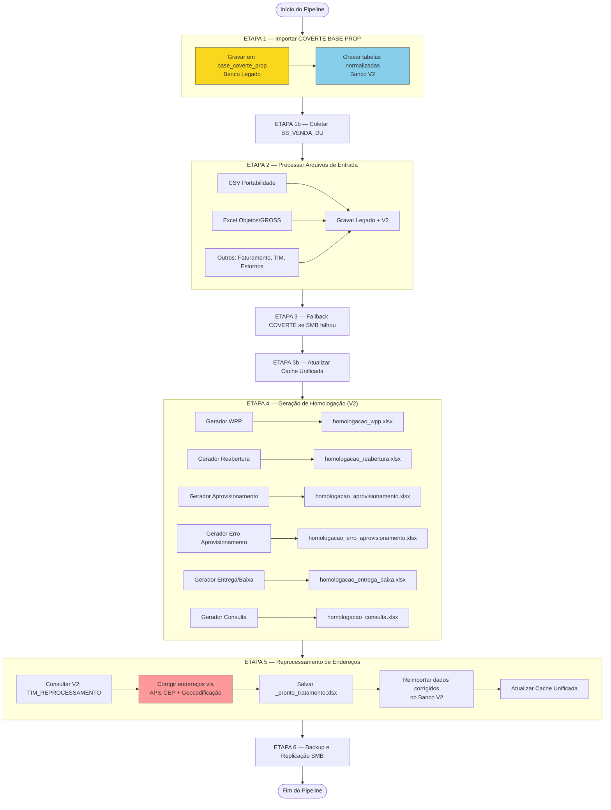
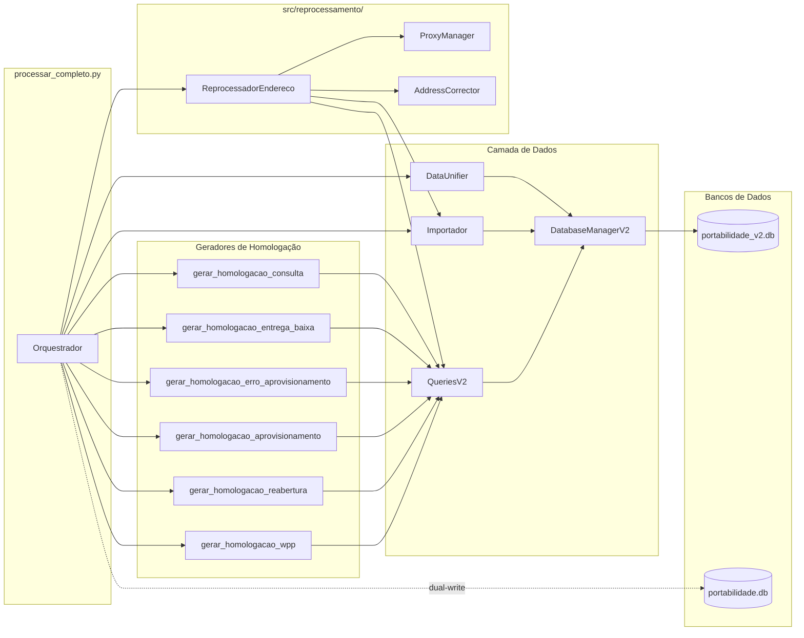
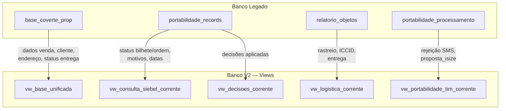
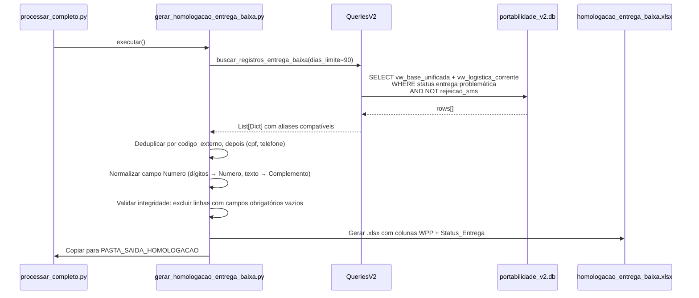
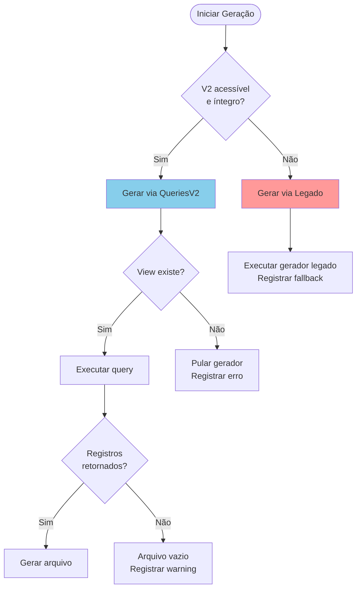

# Documento de Design — Pipeline de Processamento V2

## Visão Geral

Este documento descreve o design técnico para migrar os 6 geradores de homologação do banco legado (`portabilidade.db`) para o banco V2 (`portabilidade_v2.db`), integrar o módulo de reprocessamento de endereços inválidos do projeto externo `3F_Endereco_invalido`, e manter compatibilidade com plugins que consomem `base_coverte_prop` no banco legado.

### Princípios de Design

1. **Substituição drop-in**: Os geradores migrados devem produzir arquivos idênticos aos atuais — mesmas colunas, mesma ordem, mesmo encoding.
2. **Dual-write**: O pipeline grava em ambos os bancos (legado primeiro, V2 depois) durante a transição.
3. **Round-trip de reprocessamento**: Gerar base → corrigir endereços via proxy dinâmica → reimportar dados corrigidos no V2.
4. **Integridade total de linhas**: Nenhum arquivo de saída pode conter linhas com campos obrigatórios vazios.
5. **Fallback gracioso**: Se o V2 falha, o pipeline recai para o legado sem interromper o processamento.

### Decisões de Design

- **QueriesV2 como camada de abstração**: Todos os geradores passam a chamar métodos de `QueriesV2` ao invés de SQL direto contra o legado. Isso permite trocar a fonte de dados sem alterar a lógica de negócio dos geradores.
- **Módulo `src/reprocessamento/` autocontido**: O código do `3F_Endereco_invalido` é internalizado como pacote Python com `ProxyManager`, `AddressCorrector` e `ReprocessadorEndereco`, sem dependência de caminhos externos.
- **Cache atualizado antes da geração**: A `cache_base_unificada` é reconstruída após todas as importações (ETAPA 3b) para garantir que os geradores leiam dados frescos.
- **`lotes_importacao.tipo_arquivo` expandido**: Adicionado valor `'reprocessamento'` ao CHECK constraint para registrar lotes de reimportação de endereços corrigidos.

## Arquitetura

### Diagrama de Fluxo do Pipeline V2



### Diagrama de Componentes



### Diagrama de Migração de Dados (Legado → V2)



## Componentes e Interfaces

### 1. QueriesV2 — Expansão

A classe `QueriesV2` em `src/database/queries_v2.py` já possui 5 métodos. O novo método necessário:

```python
class QueriesV2:
    # Métodos existentes (já implementados):
    # - buscar_registros_wpp(dias_limite=180) -> List[Dict]
    # - buscar_registros_aprovisionamento(dias_limite=90) -> List[Dict]
    # - buscar_registros_reabertura(dias_limite=180) -> List[Dict]
    # - buscar_registros_consulta() -> List[Dict]
    # - buscar_registros_erro_aprovisionamento(dias_limite=90) -> List[Dict]

    def buscar_registros_entrega_baixa(self, dias_limite: int = 90) -> List[Dict[str, Any]]:
        """
        Busca registros com status de entrega problemática.
        
        Usa vw_base_unificada + vw_logistica_corrente com CTE para
        registro mais recente de logística por proposta_isize.
        
        Filtros:
        - Últimos `dias_limite` dias por data de venda
        - Status de entrega contém: cancelad, baixa, remetente, 
          aguardando correios, extravi
        - Exclusão de Rejeicao_SMS
        
        Returns:
            Lista de dicts com aliases compatíveis com gerar_homologacao_entrega_baixa.py
        """
```

**Regra de exclusão de Rejeição SMS** (aplicada em TODOS os métodos `buscar_registros_*`):

```sql
-- Verificar em vw_portabilidade_tim_corrente
AND NOT EXISTS (
    SELECT 1 FROM vw_portabilidade_tim_corrente pt
    WHERE pt.proposta_isize = bu.proposta_isize
    AND (
        LOWER(pt.motivo_conflito) LIKE '%rejei%cliente%sms%'
        OR LOWER(pt.motivo_cancelamento) LIKE '%rejei%cliente%sms%'
    )
)
-- Verificar em vw_consulta_siebel_corrente
AND NOT EXISTS (
    SELECT 1 FROM vw_consulta_siebel_corrente cs2
    WHERE cs2.proposta_isize = bu.proposta_isize
    AND (
        LOWER(cs2.status_bilhete) LIKE '%rejeicao sms%'
        OR LOWER(cs2.motivo_recusa) LIKE '%rejei%cliente%sms%'
        OR LOWER(cs2.motivo_cancelamento) LIKE '%rejei%cliente%sms%'
    )
)
```

**Fallback de CPF e codigo_externo** (prioridade em todos os métodos):
1. `vw_base_unificada.cpf` (equivalente a `base_coverte_prop`)
2. `vw_consulta_siebel_corrente.cpf` (equivalente a `portabilidade_records`)
3. `vw_logistica_corrente.documento` (equivalente a `relatorio_objetos`)

```sql
COALESCE(bu.cpf, cs.cpf, l.documento) AS cpf
```

### 2. Módulo src/reprocessamento/

Estrutura do pacote:

```
src/reprocessamento/
├── __init__.py              # Exporta ReprocessadorEndereco, ProxyManager
├── reprocessador.py         # Classe principal ReprocessadorEndereco
├── proxy_manager.py         # Gerenciador de proxy dinâmica
├── address_corrector.py     # Validação e correção de endereços
└── queries_reprocessamento.py  # Query TIM_REPROCESSAMENTO adaptada para V2
```

#### 2.1 ReprocessadorEndereco

```python
class ReprocessadorEndereco:
    """Orquestra o fluxo de reprocessamento de endereços inválidos."""

    def __init__(
        self,
        db_v2_path: str,
        periodo_dias: int = 180,
        diretorio_saida: str = None,
        config_proxies: Union[str, List[str]] = None,
        workers: int = 4,
    ):
        self.queries = QueriesV2(db_v2_path)
        self.proxy_manager = ProxyManager(config_proxies)
        self.corrector = AddressCorrector(self.proxy_manager)
        self.periodo_dias = periodo_dias
        self.diretorio_saida = diretorio_saida or str(PASTA_SAIDA_HOMOLOGACAO)
        self.workers = workers

    def executar(self) -> Dict[str, Any]:
        """
        Fluxo completo: consultar → corrigir → salvar → reimportar.
        
        Returns:
            Métricas: total, corrigidos, mantidos_original, erros, 
                      arquivo_saida, tempo_execucao
        """

    def _consultar_registros(self) -> pd.DataFrame:
        """Executa TIM_REPROCESSAMENTO contra V2."""

    def _corrigir_enderecos(self, df: pd.DataFrame) -> pd.DataFrame:
        """
        Corrige endereços inválidos via APIs.
        Garante integridade: campos não corrigidos mantêm valor original.
        """

    def _classificar_tipo_entrega(self, row: pd.Series) -> str:
        """Express se entrega <= 2 dias da venda, senão Correios."""

    def _salvar_arquivo(self, df: pd.DataFrame) -> Path:
        """Salva _pronto_tratamento.xlsx na pasta de saída."""

    def _reimportar_no_v2(self, arquivo: Path) -> Dict[str, Any]:
        """
        Reimporta dados corrigidos no V2 como nova versão.
        Registra lote com tipo 'reprocessamento'.
        Atualiza cache para cada proposta_isize afetada.
        """
```

#### 2.2 ProxyManager

```python
class ProxyManager:
    """Gerenciador de pool de proxies com rotação dinâmica."""

    def __init__(self, config: Union[str, List[str]] = None):
        """
        Args:
            config: Caminho para arquivo de proxies ou lista de URLs.
                    Formato: um proxy por linha (http://host:port)
        """
        self._pool: List[ProxyInfo] = []
        self._pool_lock = threading.Lock()
        self._current_index = 0
        self._stats = {'total_requests': 0, 'successes': 0, 'failures': 0}

    def get_proxy(self) -> Optional[Dict[str, str]]:
        """Retorna próximo proxy válido do pool (round-robin)."""

    def report_success(self, proxy_url: str) -> None:
        """Registra sucesso para o proxy."""

    def report_failure(self, proxy_url: str) -> None:
        """
        Registra falha. Remove proxy após N falhas consecutivas.
        Substitui por outro do pool se disponível.
        """

    def validate_all(self) -> int:
        """Testa conectividade de todos os proxies. Retorna qtd válidos."""

    @property
    def metrics(self) -> Dict[str, Any]:
        """Retorna métricas: ativos, falhas, taxa de sucesso."""

@dataclass
class ProxyInfo:
    url: str
    failures: int = 0
    successes: int = 0
    active: bool = True
    last_used: Optional[datetime] = None
```

#### 2.3 AddressCorrector

```python
class AddressCorrector:
    """Valida e corrige endereços via APIs de CEP e geocodificação reversa."""

    def __init__(self, proxy_manager: ProxyManager):
        self.proxy_manager = proxy_manager

    def corrigir(self, endereco: Dict[str, str]) -> Dict[str, str]:
        """
        Tenta corrigir endereço inválido.
        
        Estratégia:
        1. Consultar API de CEP (ViaCEP, BrasilAPI)
        2. Se CEP inválido, geocodificação reversa com fuzzy matching
        3. Se tudo falha, retorna endereço original (integridade)
        
        Returns:
            Dict com campos: endereco, numero, complemento, 
                            bairro, cidade, uf, cep
        """

    def _consultar_cep(self, cep: str) -> Optional[Dict]:
        """Consulta API de CEP com proxy rotation."""

    def _geocodificar_reverso(self, endereco_completo: str) -> Optional[Dict]:
        """Geocodificação reversa com fuzzy matching."""
```

### 3. Integração com processar_completo.py

Pontos de integração no orquestrador:

```python
# processar_completo.py — Alterações necessárias

def main():
    args = parse_args()  # Adicionar --apenas-reprocessamento, --skip-reprocessamento
    
    # ... ETAPAS 1-3 existentes ...
    
    # ETAPA 3b (NOVA): Atualizar Cache Unificada
    if not args.apenas_reprocessamento:
        atualizar_cache_completa(db_v2)
    
    # ETAPA 4: Geração de Homologação
    if not args.apenas_bases:
        if usar_v2(db_v2):
            gerar_homologacao_v2(db_v2)  # Usa QueriesV2
        else:
            gerar_homologacao_legado()    # Fallback
    
    # ETAPA 5 (NOVA): Reprocessamento de Endereços
    if not args.skip_reprocessamento:
        from src.reprocessamento import ReprocessadorEndereco
        reprocessador = ReprocessadorEndereco(
            db_v2_path=db_v2_path,
            periodo_dias=180,
            diretorio_saida=str(PASTA_SAIDA),
        )
        resultado = reprocessador.executar()
        registrar_metricas(exec_id, 'reprocessamento_enderecos', resultado)
    
    # ETAPA 6: Backup e replicação
    # ... existente ...
```

**Função de decisão V2 vs Legado:**

```python
def usar_v2(db_v2) -> bool:
    """Decide se usa V2 ou fallback para legado."""
    if args.forcar_legado:
        return False
    if args.forcar_v2:
        return True
    try:
        resultado = db_v2.validar_integridade()
        return resultado['ok']
    except Exception:
        logger.warning("V2 indisponível, usando legado")
        return False
```

### 4. Fluxo de Dados — Gerador Migrado (Exemplo: Entrega/Baixa)



## Modelo de Dados

### Alterações no Schema V2

O schema existente (`src/database/schema.py`) não requer novas tabelas. As alterações necessárias são:

#### 1. Expandir CHECK constraint de `lotes_importacao.tipo_arquivo`

```sql
-- Atual:
CHECK (tipo_arquivo IN (
    'coverte_prop', 'portabilidade_tim', 'gross',
    'relatorio_objetos', 'resultado_gross', 'backoffice',
    'consulta_siebel', 'migracao'
))

-- Novo (adicionar 'reprocessamento'):
CHECK (tipo_arquivo IN (
    'coverte_prop', 'portabilidade_tim', 'gross',
    'relatorio_objetos', 'resultado_gross', 'backoffice',
    'consulta_siebel', 'migracao', 'reprocessamento'
))
```

#### 2. Campos de endereço na tabela `clientes` (já existentes)

A reimportação de endereços corrigidos usa os campos já existentes na tabela `clientes`:
- `endereco`, `numero`, `complemento`, `bairro`, `cidade`, `uf`, `cep`

A reimportação insere uma nova versão do registro `clientes` (INSERT-only) com os campos de endereço corrigidos, mantendo o histórico completo.

#### 3. Views utilizadas pelos geradores

Todas as views já existem no schema V2:

| View | Uso |
|------|-----|
| `vw_base_unificada` | Dados consolidados (venda, cliente, endereço, status) |
| `vw_consulta_siebel_corrente` | Dados Siebel (status bilhete/ordem, motivos) |
| `vw_logistica_corrente` | Dados logística (rastreio, ICCID, entrega) |
| `vw_portabilidade_tim_corrente` | Validação rejeição SMS, proposta_isize |
| `vw_decisoes_corrente` | Decisões aplicadas (regra, ação, template) |
| `vw_propostas_corrente` | Dados de proposta (data venda, produto, plano) |
| `vw_clientes_corrente` | Dados de cliente (endereço, telefone) |
| `cache_base_unificada` | Cache materializado da vw_base_unificada |

### Mapeamento de Aliases (Legado → V2)

Para garantir compatibilidade drop-in, os métodos de `QueriesV2` retornam dicts com os mesmos nomes de campo que os geradores esperam:

| Campo no Gerador | Origem Legada | Origem V2 |
|---|---|---|
| `codigo_externo` | `base_coverte_prop.id_proposta_isize` | `bu.proposta_isize` |
| `cpf` | `base_coverte_prop.cpf` | `COALESCE(bu.cpf, cs.cpf, l.documento)` |
| `cliente_nome` | `base_coverte_prop.cliente` | `bu.nome_cliente` |
| `telefone_portado` | `base_coverte_prop.telefone_portabilidade` | `bu.telefone_portabilidade` |
| `numero_acesso` | `portabilidade_records.numero_acesso` | `cs.numero_acesso` |
| `numero_ordem` | `portabilidade_records.numero_ordem` | `cs.numero_ordem` |
| `status_bilhete` | `portabilidade_records.status_bilhete` | `cs.status_bilhete` |
| `status_ordem` | `portabilidade_records.status_ordem` | `cs.status_ordem` |
| `ro_iccid` | `relatorio_objetos.iccid` | `l.iccid` |
| `ro_status_entrega` | `relatorio_objetos.status` | `l.status` |
| `ro_data_entrega` | `relatorio_objetos.data_entrega` | `l.data_entrega` |
| `ro_rastreio` | `relatorio_objetos.rastreio` | `l.rastreio` |
| `ro_transportadora` | `relatorio_objetos.transportadora` | `l.transportadora` |
| `ro_ultima_ocorrencia` | `relatorio_objetos.ultima_ocorrencia` | `l.ultima_ocorrencia` |
| `crivo_vendas` | `base_coverte_prop.crivo_vendas` | `bu.status_venda` (mapeado como 'APROVADA') |
| `status_correios` | `base_coverte_prop.status_correios` | `re.status_correios` via `vw_rastreio_corrente` |
| `status_loggi` | `base_coverte_prop.status_loggi` | `re.status_loggi` via `vw_rastreio_corrente` |
| `status_entrega_prevista` | `base_coverte_prop.status_entrega_prevista` | `bc.status_entrega_prevista` via `vw_bluechip_corrente` |

### Estratégia de Integridade de Dados

A integridade total de linhas é garantida em 3 camadas:

1. **Na query (QueriesV2)**: `COALESCE` para campos com múltiplas fontes, `WHERE campo IS NOT NULL` para campos obrigatórios.

2. **No gerador**: Validação pós-query que exclui linhas com campos obrigatórios vazios e registra no log:
```python
def validar_integridade_linha(row: Dict, campos_obrigatorios: List[str]) -> bool:
    for campo in campos_obrigatorios:
        if not row.get(campo) or str(row[campo]).strip() == '':
            logger.warning(f"Registro incompleto excluído: {row.get('codigo_externo')} — campo {campo} vazio")
            return False
    return True
```

3. **No reprocessamento**: Endereços não corrigidos mantêm valor original — nunca ficam vazios:
```python
def corrigir_com_fallback(original: Dict, corrigido: Optional[Dict]) -> Dict:
    if corrigido is None:
        return original  # Mantém dados originais
    # Merge: corrigido sobrescreve, mas campos vazios no corrigido usam original
    return {k: corrigido.get(k) or original.get(k) for k in original}
```

## Propriedades de Corretude

*Uma propriedade é uma característica ou comportamento que deve ser verdadeiro em todas as execuções válidas de um sistema — essencialmente, uma declaração formal sobre o que o sistema deve fazer. Propriedades servem como ponte entre especificações legíveis por humanos e garantias de corretude verificáveis por máquina.*

### Propriedade 1: Exclusão universal de Rejeição SMS

*Para qualquer* método `buscar_registros_*` da classe `QueriesV2` e *para qualquer* estado do banco V2, nenhum registro retornado deve ter indicadores de rejeição SMS — ou seja, nenhum registro onde `motivo_conflito`, `motivo_cancelamento`, `status_bilhete`, `motivo_recusa` contenham padrões de rejeição SMS (`'rejei%cliente%sms'` ou `'rejeicao sms'`) nas tabelas `vw_portabilidade_tim_corrente` ou `vw_consulta_siebel_corrente`.

**Valida: Requisitos 1.2, 2.3, 3.3, 4.4, 5.4, 6.4, 7.4**

### Propriedade 2: CTE seleciona registro mais recente por chave

*Para qualquer* conjunto de registros com múltiplas versões por `proposta_isize` (ou `codigo_externo`), os métodos de `QueriesV2` que usam CTE (reabertura, entrega/baixa, consulta) devem retornar apenas o registro com a maior versão/data de atualização para cada chave, e a contagem de classificações deve refletir o total real de registros históricos.

**Valida: Requisitos 2.2, 5.2, 6.3**

### Propriedade 3: Fallback de CPF respeita prioridade

*Para qualquer* registro retornado por qualquer método `buscar_registros_*`, o campo `cpf` deve seguir a cadeia de prioridade: `vw_base_unificada.cpf` > `vw_consulta_siebel_corrente.cpf` > `vw_logistica_corrente.documento`. Se o CPF está presente na fonte de maior prioridade, as fontes de menor prioridade não devem sobrescrevê-lo.

**Valida: Requisitos 2.6, 3.6, 7.6**

### Propriedade 4: Normalização de Numero é correta

*Para qualquer* string de endereço contendo dígitos e texto, a função `extrair_numero_e_complemento()` deve produzir um campo `Numero` contendo apenas dígitos e um campo `Complemento` contendo o texto restante. A concatenação de `Numero` + `Complemento` deve preservar toda a informação original (round-trip de conteúdo).

**Valida: Requisitos 1.4, 5.5**

### Propriedade 5: Expansão de linhas Portabilidade vs Aquisição

*Para qualquer* registro processado pelo Gerador_Consulta: se `telefone_portado` é válido (não nulo, não vazio) e diferente de `numero_linha`, o gerador deve produzir exatamente 2 linhas (uma com telefone_portado, outra com numero_linha como `Número de acesso`). Se `telefone_portado` é inválido ou igual a `numero_linha`, deve produzir exatamente 1 linha.

**Valida: Requisitos 6.5, 6.6**

### Propriedade 6: Integridade total de linhas nos arquivos de saída

*Para qualquer* arquivo de saída gerado pelo pipeline (homologação ou reprocessamento), *toda* linha presente no arquivo deve ter *todos* os campos obrigatórios preenchidos (não nulos, não vazios). Se um campo obrigatório não pode ser preenchido, a linha inteira deve ser excluída do arquivo. No caso específico do reprocessamento, campos de endereço não corrigidos devem manter o valor original.

**Valida: Requisitos 10.6, 11.6, 11.7, 13.6**

### Propriedade 7: Classificação de Tipo Entrega

*Para qualquer* registro com `data_venda` e `data_entrega` válidas, a classificação de "Tipo entrega" deve ser "Express" quando a diferença entre `data_entrega` e `data_venda` é ≤ 2 dias, e "Correios" quando a transportadora é "Correios" ou a diferença excede 2 dias.

**Valida: Requisitos 10.11, 11.5**

### Propriedade 8: ProxyManager rotaciona e remove proxies corretamente

*Para qualquer* sequência de chamadas `get_proxy()` / `report_success()` / `report_failure()`, o `ProxyManager` deve: (a) rotacionar entre proxies ativas em round-robin, (b) remover um proxy do pool ativo após N falhas consecutivas, (c) nunca retornar um proxy marcado como inativo, (d) manter métricas consistentes (total_requests = successes + failures).

**Valida: Requisitos 10.4, 11.4**

### Propriedade 9: Filtros de status retornam apenas registros correspondentes

*Para qualquer* estado do banco V2, `buscar_registros_aprovisionamento()` deve retornar apenas registros com `status_ordem = 'Em Aprovisionamento'` ou `status_bilhete = 'Em Aprovisionamento'` (excluindo 'Erro no Aprovisionamento'), e `buscar_registros_erro_aprovisionamento()` deve retornar apenas registros com `status_ordem = 'Erro no Aprovisionamento'` ou `status_bilhete = 'Erro no Aprovisionamento'`. Os conjuntos retornados devem ser disjuntos.

**Valida: Requisitos 3.2, 4.2**

### Propriedade 10: IDs forçados ignoram filtros

*Para qualquer* conjunto de IDs em `ids_forcar_wpp.txt` que existam no banco V2, o Gerador_WPP deve incluí-los no arquivo de saída independentemente do valor de `crivo_vendas`, `acao_a_realizar` ou qualquer outro filtro aplicado aos registros normais.

**Valida: Requisito 1.6**

### Propriedade 11: Contagem de classificações é precisa

*Para qualquer* `codigo_externo` com N registros históricos de classificação com status "Erro no Aprovisionamento", o campo `total_classificacoes` retornado por `buscar_registros_erro_aprovisionamento()` deve ser igual a N, e `houve_reclassificacao` deve ser "SIM" se N > 1 e "NAO" se N = 1.

**Valida: Requisitos 4.6**

### Propriedade 12: NULL no V2 vira string vazia no arquivo de saída

*Para qualquer* campo retornado como NULL/None por `QueriesV2`, o arquivo de saída gerado pelo gerador correspondente deve conter string vazia (`""`) nessa posição, nunca o literal "None" ou "NULL".

**Valida: Requisito 13.1**

### Propriedade 13: Aliases de colunas são compatíveis com geradores

*Para qualquer* método `buscar_registros_*` da classe `QueriesV2`, as chaves dos dicionários retornados devem conter exatamente os nomes de campo que o gerador correspondente espera, garantindo substituição drop-in sem alteração na lógica dos geradores.

**Valida: Requisito 7.2**

### Propriedade 14: Cache atualizado reflete dados importados

*Para qualquer* `proposta_isize` afetada por uma importação, após a chamada de `atualizar_cache_unificada()`, a tabela `cache_base_unificada` deve conter os dados mais recentes dessa proposta, consistentes com o que `vw_base_unificada` retornaria.

**Valida: Requisito 9.1**

## Tratamento de Erros

### Hierarquia de Erros

| Nível | Situação | Ação |
|-------|----------|------|
| **CRÍTICO** | Falha na gravação do Banco Legado (ETAPA 1) | Interromper etapa de importação COVERTE. Plugins dependem dessa tabela. |
| **ERRO** | Falha na gravação do Banco V2 | Registrar erro, continuar pipeline. Legado já foi atualizado. |
| **ERRO** | View V2 não existe ao executar gerador | Registrar erro, pular gerador. Demais geradores continuam. |
| **ERRO** | Falha de integridade no V2 ao iniciar pipeline | Ativar fallback para Legado. Registrar evento. |
| **WARNING** | Falha na atualização de cache para um registro | Registrar, continuar com demais registros. |
| **WARNING** | Todas as proxies falharam durante reprocessamento | Manter endereço original, continuar com próximo registro. |
| **WARNING** | API de CEP/geocodificação indisponível | Manter endereço original, registrar no log. |
| **WARNING** | SMB não montado para backup | Tentar montar automaticamente. Se falhar, registrar e continuar. |
| **INFO** | Registro excluído por campo obrigatório vazio | Registrar no log com detalhes do campo e proposta_isize. |

### Fallback V2 → Legado



### Estratégia de Retry no Reprocessamento

```python
# Retry com backoff exponencial para APIs de CEP
MAX_RETRIES = 3
BACKOFF_BASE = 1.0  # segundos

for attempt in range(MAX_RETRIES):
    proxy = proxy_manager.get_proxy()
    try:
        resultado = consultar_api_cep(cep, proxy)
        proxy_manager.report_success(proxy['http'])
        return resultado
    except (ConnectionError, Timeout):
        proxy_manager.report_failure(proxy['http'])
        time.sleep(BACKOFF_BASE * (2 ** attempt))

# Todas as tentativas falharam → manter endereço original
return endereco_original
```

## Estratégia de Testes

### Abordagem Dual

O pipeline V2 será testado com uma combinação de:

1. **Testes de propriedade (property-based)**: Para validar propriedades universais que devem valer para qualquer entrada (filtros, transformações, integridade).
2. **Testes unitários (example-based)**: Para cenários específicos, formatos de saída e edge cases.
3. **Testes de integração**: Para verificar o fluxo completo entre componentes (pipeline end-to-end, dual-write, fallback).

### Testes de Propriedade

**Biblioteca**: `hypothesis` (Python)

**Configuração**: Mínimo 100 iterações por propriedade.

**Tag format**: `Feature: v2-processing-pipeline, Property {N}: {título}`

Cada propriedade do documento de design (Propriedades 1-14) será implementada como um teste de propriedade individual usando `hypothesis`. Os geradores criarão:

- Registros de banco V2 com campos aleatórios (datas, status, CPFs, endereços)
- Bancos SQLite in-memory com dados seed variados
- Strings de endereço com combinações aleatórias de dígitos e texto
- Sequências de operações de proxy (success/failure)
- Conjuntos de registros com duplicatas intencionais

**Propriedades prioritárias para implementação:**

| Propriedade | Complexidade | Prioridade |
|-------------|-------------|------------|
| P1: Exclusão Rejeição SMS | Média | Alta — afeta todos os geradores |
| P4: Normalização Numero | Baixa | Alta — função pura, fácil de testar |
| P5: Expansão Portabilidade/Aquisição | Baixa | Alta — regra de negócio crítica |
| P6: Integridade de linhas | Média | Alta — requisito transversal |
| P7: Tipo Entrega | Baixa | Alta — função pura |
| P8: ProxyManager | Média | Média — componente novo |
| P9: Filtros de status | Média | Alta — corretude dos geradores |
| P12: NULL → string vazia | Baixa | Alta — compatibilidade de formato |

### Testes Unitários

- Formato de saída de cada gerador (colunas, encoding, separador)
- Edge cases: banco vazio, view inexistente, arquivo de proxies vazio
- Deduplicação por (cpf, numero_acesso) e por codigo_externo
- Limite de 20.000 registros no Gerador_Consulta
- Flags CLI (`--apenas-reprocessamento`, `--forcar-legado`, `--forcar-v2`)

### Testes de Integração

- Pipeline completo com banco V2 seed → verificar todos os 6 arquivos gerados
- Dual-write: importar COVERTE → verificar dados em ambos os bancos
- Fallback: simular V2 corrompido → verificar geração via legado
- Round-trip reprocessamento: gerar → corrigir → reimportar → verificar cache atualizado
- Backup e replicação SMB (mock do filesystem)
